### NGS Workflows
When working with NGS sequencers, we feed it with a DNA library, and obtain raw read data off of the sequencer. This raw data often cannot be used directly, and will typically need to pass through a number of tools before we can obtain our desired output. The execution of this set of tools in a specified order is commonly referred to as a *workflow* or *pipeline*. However, there is usually no "One Size Fits All" workflow, as different applications and projects will likely require different tools and hence *workflows*. However, there will often be commonalities between each *workflow*, such as how many *workflows* might require or work with seqeunce alignment data.

One of the most common and basic uses of the Nanopore sequencer in our lab involves 1) Plasmid De novo Assembly, and 2) Alignment to a Reference Sequence/Genome. This processes from the start to end can be represented as a basic *workflow* shown in the image below. 

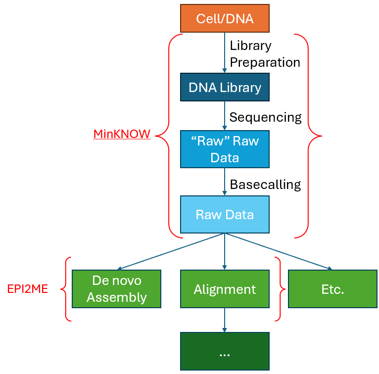

In the *workflow* shown above, it can be mainly divided into two segments. First is the sequencing stage, which will be handled by the MinKNOW UI application. Next is the analysis stage, which is where most of the bioinformatics is involved. In this segment, we will go through the run parameters users should be aware and concerned of within MinKNOW so that they can maximise their throughput, and at the same time ensure that they are getting what they need from the sequencing run. Note that here we will mainly be talking about the Flongle flowcell, used with a MINion Mk1b Sequencer.

### MinKNOW

The MinKNOW UI is the software that drives and controls the Nanopore Sequencing devices. It controls the sequencer with the run parameters set by the user, and handles data acquisition from the seqeuncer, and allows for real-time analysis and feedback. Here, we will be concerned with two of the functions available in the MinKNOW UI -- namely the "*Flow Cell Check*" and the actual Sequencing, through the "*Start Sequencing*" function. These can be accessed through the "*Start*" page tab.

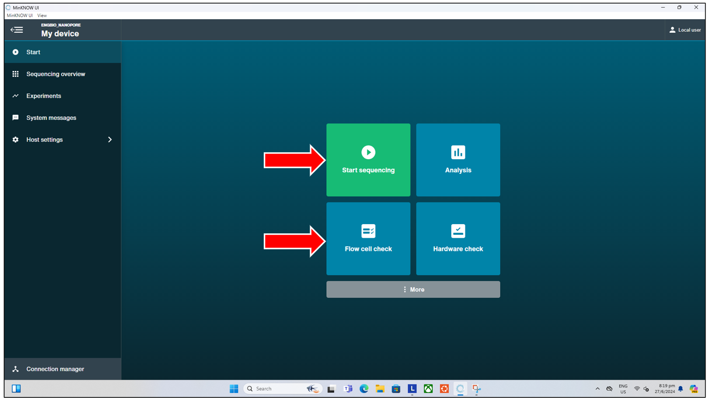

#### Flow Cell Check

The flow cell check is a vital function that should be performed prior to the loading of DNA Library into any flow cell, and the start of any sequencing run. The flow cell check verifies the condition of the flow cell, ensuring that there are sufficient pores available for sequencing, and highlights to the experienced user any possible issues with the flow cell. So as to reduce unnecesssary trouble that might arise from loading and starting a run on a "bad" flow cell. To start a flow cell check, simply click on the "*Flow Cell Check*" button from the "*Start*" tab page shown above. This will then bring us to the next page where we can:
- Enter the Flow cell ID.
- Select the Flow cell type (typically *FLO-FLG114* for our lab as of June 2024).

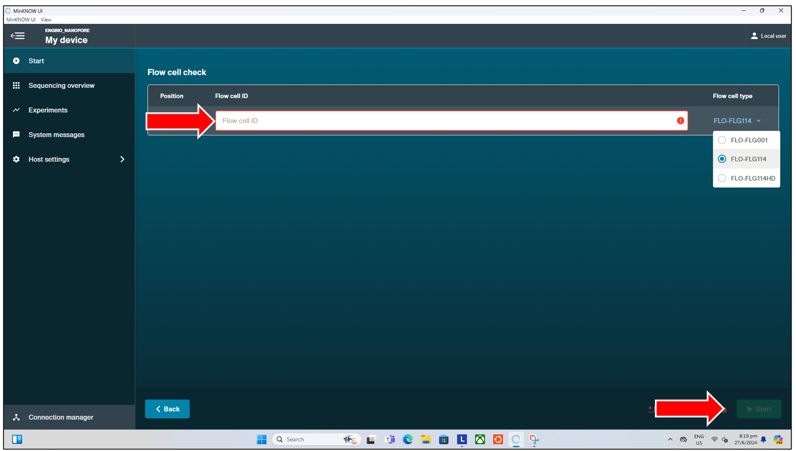

Pressing the "*Start*" button will begin the flow cell check, where after a short approx 10-15 minutes wait, we will get either one of two possible results, shown below in their respective orders:
- Flow cell check ***PASSED***
  - This signifies the flow cell check has passed, and the flow cell has at least 50 (out of 126) pores available. Users can proceed with loading their library and starting the run as per normal

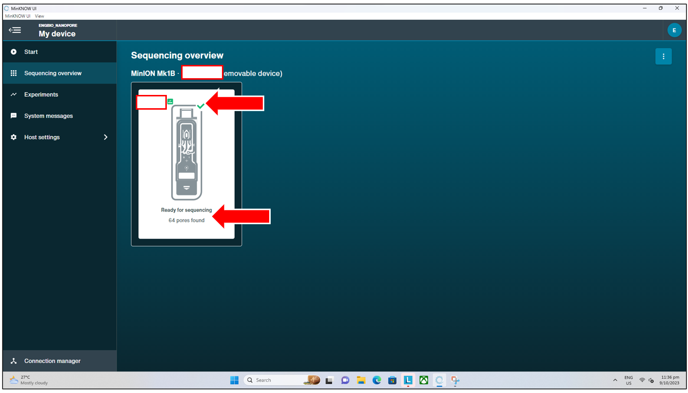

- Flow cell check ***FAILED***
  - This signifies the flow cell check has failed, as there are fewer than 50 (out of 126) pores available per flow cell.
  - However, this does not immediately suggest the flow cell is unusable and should be discarded. Users should consider the following and proceed based on their own discretion.
      - IF above 30 pores, and a high throughput is not exactly needed: users might be able to proceed.
      - IF below 30 pores, and/or a high throughput is required: users should change to a different, new flow cell.

#### Sequencing Run Setup

After having checked the flow cell is functional, and users decide to proceed with the same flow cell, they can then load the flow cell with their library prepped DNA sample as per the recommended protocol from ONT. They can then set up and start the actual sequencing run by pressing on "*Start Sequencing*" from the "*Start*" tab page shown above. This will bring us to the next page where we can:
- Enter the experiment name (will be saved to a folder name entered here at "C:\data"). 
- Enter the Flow cell ID.
- Select the Flow cell type (typically *FLO-FLG114* for our lab as of June 2024).

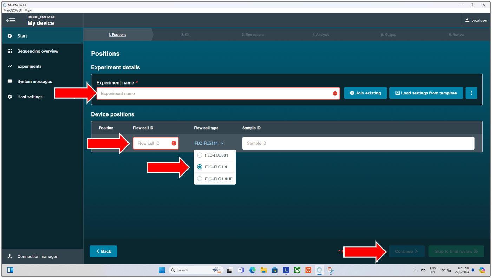

This will bring us to the next page, where we can select the library preparation kit from ONT used. Listed below are the kits currently available in lab, for quick reference:
- Amplicon seq: SQK-LSK114
- Amplicon Native barcoding:   SQK-NBD114-24
- Rapid barcoding : SQK-RBK114-96

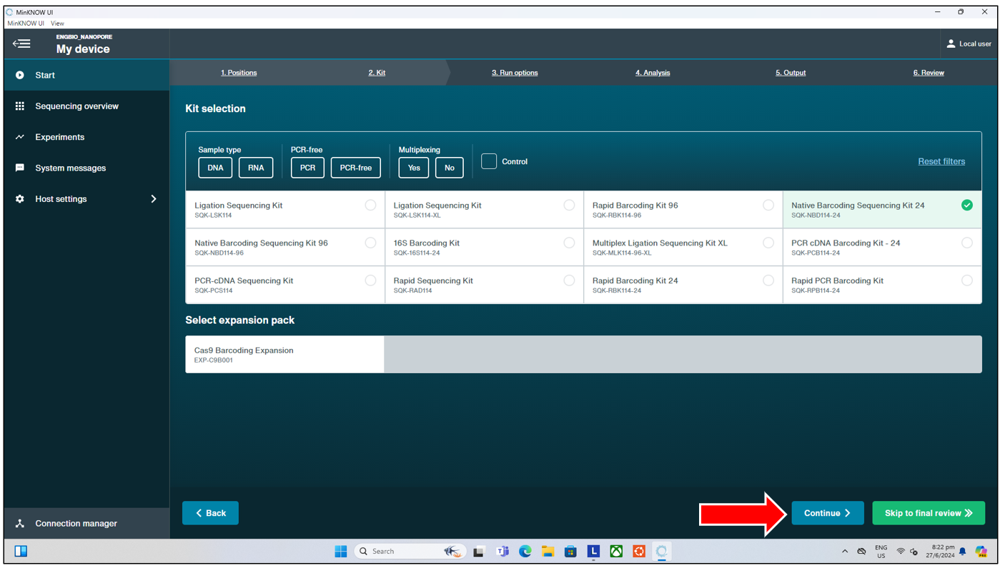

The next page brings us to the "Run Options", where we can select the 
- Run limit of this seqeuncing run (default 24hrs, max 72hrs; though most (90%) of data output should be delivered within the first 12 to 16hrs).
- Minimum read length (default 200bp, can select 20bp if users will be doing short read sequencing, though shorter reads tend to have average overall lower read quality).

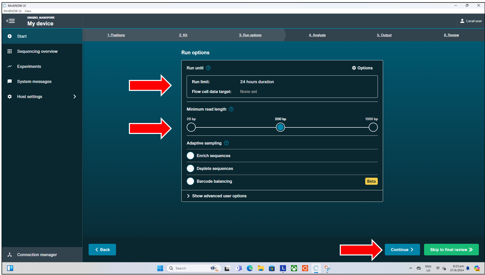

Next is the "Analyze" page, where we can select:
- Basecalling options: select "*Super-accurate Basecalling*" for best results. More about basecalling will be described below.
- Barcoding options: ONLY AVAILABLE IF LIBRARY PREP KITS WITH BARCODING FROM ONT ARE USED! If ONT barcoding kits are used, select "*Enabled*", "*Trim barcodes*" and "*Detect mid read barcodes*"

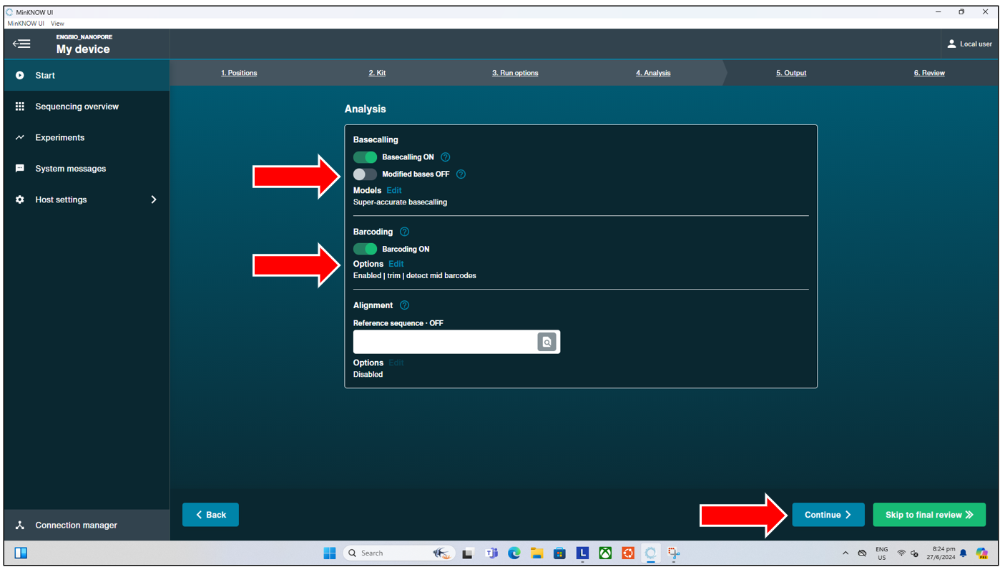

This is followed by the "Output" page, where users can select the read quality score (Qscore) that will be filtered as "Pass" when basecalled. The default Qscore is 10. If short read sequencing is performed, users might want to consider reducing the Qscore here to e.g. 7 or 8. More on Qscore will be explained below.

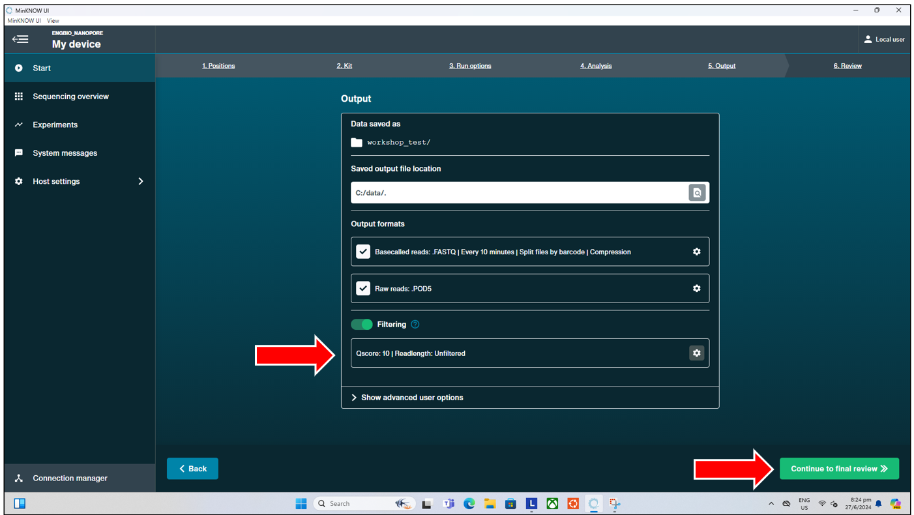

Lastly, is the "Review" page. Nothing needs to be selected here, users can just press "*Start*" to start the sequencing run.

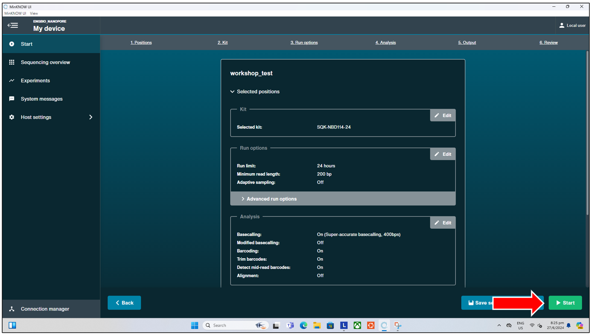

#### Monitoring the Run 

Once the sequencing run has started, users can monitor the run in real time. During this time, users can look out for signs of the flow cell failing prematurely, such as by observing the number of pores available in real time (pore scan performed every 1.5hrs by default) under "*Available Pores*", and also by looking at the "*Cumulative Output*" from the sequencer in real time. If users start seeing a sudden plateau in the output, users can manually start a pore scan by pressing the "*Start Pore Scan*" button at the top, and checking if the number of pores available has significantly dropped all of a sudden. 
- If the number of pores has dropped suddenly (to near 0), this could indicate a potential issue with the flowcell, and users might consider reloading their remaining DNA library into a new flow cell.
- If the number of pores indicated is still high, but the output has plateaued and one cannot observe any further sequencing, this could indicate an issue during the library preparation. Users should double check their sequencing run parameters, and consider redoing the library preparation, before loading this new library into a new flow cell.

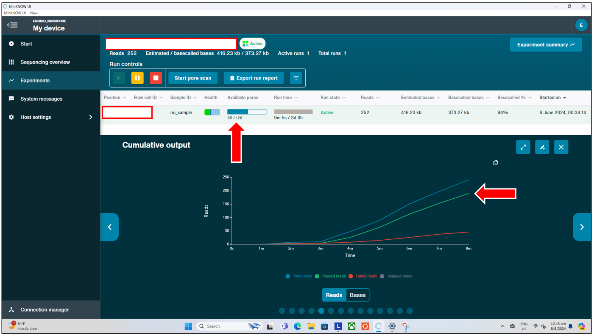

Additionally, if users used any of the barcoding kits from ONT, they can also monitor the "Barcodes Hit" in real time, to see if they observe barcodes hit corresponding to what they have loaded and are expecting. If users observe none of their expected barcodes are being "hit", with a significant number classified under "Unclassified" or "Failed"; and/or yet they see continued output in real time, it could indicate an issue with the library preperation. Users should then re-perform library preperation, before loading this new library into a new flow cell.

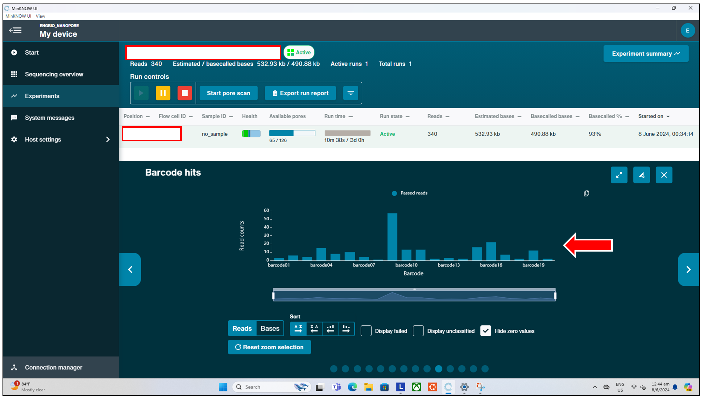

Lastly, users may also choose to stop the run prematurely to save their time when they observe that the number of available pores has dropped to almost 0 after more than 12 hours. As from this point onwards, users can expect about at most 1k reads per hour. This is normal, as most of the output are expected during the first 12 to 16 hours of a run on the Flongle flow cell.

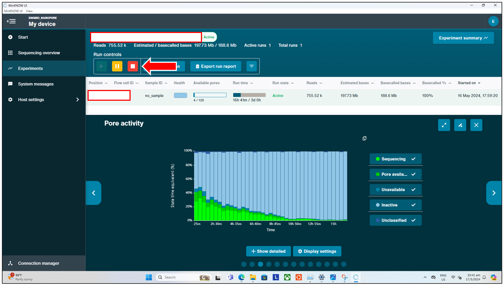

### Data Output and Basecalling

The raw data output from the sequencer comes in two formats. The "rawest" data is in the form of **.FAST5** (for older e.g. R9 generation flow cells), and **.POD5** for newer (e.g. R10 onwards) flow cells -- also known as "Squiggles", as they hold the raw current intensity data recorded by each pore. This format however is unreadable by us directly (on e.g. a text editor), and also unusable directly downstream in most cases, and typically has to be converted into the **.FASTQ** format through the process of "**Basecalling**", which is the process of converting the "Squiggles" (or electrical signal) into the actual "ATGC" bases. This conversion process typically relies on machine learning and neural networks which have been trained on training data at the ONT side. The "Basecalling options" we chose above during the run setup in MinKNOW affects the accuracy of this conversion, and hence the "Super-accurate" basecalling model should be always chosen whenever available for best results (this however is dependent on the compute power of the computer used for basecalling; where a computer with an Nvidia dedicated GPU capable of running [CUDA toolkit version 11.8] as of June 2024 is required for running the "*High Accuracy*" and "*Super Accurate*" models. Nevertheless, the Nanopore Desktop in the lab is capable of running the "*Super Accurate*", and hence should be always used.). This **.FASTQ** format is the one subsequently used/required as the input to most bioinformatics workflows. The [figure below illustrates the basecalling process].

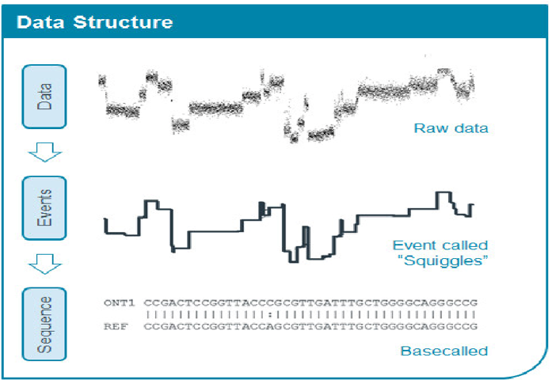

### FASTQ Format

While the data stored in the **FASTQ** format looks complicated and confusing, we can understand the [**FASTQ**] format with a little decoding, and compare it with the **FASTA** format that some may already be familiar with.

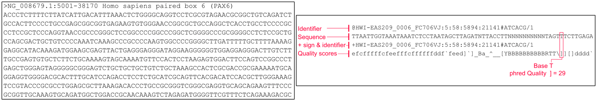

The [image above] shows the **FASTA** format on the left, and **FASTQ** on the right.

The **FASTA** file consists of 2 lines per entry, repeated every 2 lines for each entry.

|Line|Description|
|----|-----------|
|1|**“Description line”**, starts with a “>” symbol. Contains information about the sequence. E.g. ID, name, gene names etc.|
|2|The **actual** nucleotide (or protein) **sequences**|

Meanwhile the **FASTQ** format is in a way similar to the **FASTA** format, but with 4 lines per entry. Each 4 lines corresponds to the data from **ONE** read sequence from the sequencer. This is the typical "raw" data we will deal with from most NGS platforms, including Illumina short read sequencers, and even some Sanger platforms.

|Line|Description|
|----|-----------|
|1|**Sequence Identifier**, starts with a “*@*”. Also includes information about the sequence, but instead of gene names etc., it is usually information about the sequencer machine etc.|
|2|The **actual DNA sequence**|
|3|**Usually just a “+” symbol**. Marks the end of the sequence|
|4|**Quality scores** for each base, encoded in Phred +33 format typically for most modern platforms. MUST have the same number of characters as the actual sequence|

### Quality Scores (Qscore)

From the **FASTQ** file, we know that each ATGC base called has a corresponding **Quality Score**, which is typically encoded in Phred +33 format and is recorded in ASCII format (so that the number of bases can be exactly equal to the number of characters in line 4 of each FASTQ read). This quality score reflects the confidence by the sequencer for the estimated error rate for each of the basecalled bases, and is on a negative Log(10) scale. Hence higher Qscores reflect a greater confidence in the accuracy of a predicted base, and vice versa for lower Qscores. 

The default Qscore set in MinKNOW has a Qscore of 10, which translates to an estimated probability of error of 10%. A Qscore of 20 (which is the current expected accuracy for R10, V14 kits) will then mean an estimated probability of error of 1%. The translatation of each ASCII character to their respective Qscores can be found in the [table below].

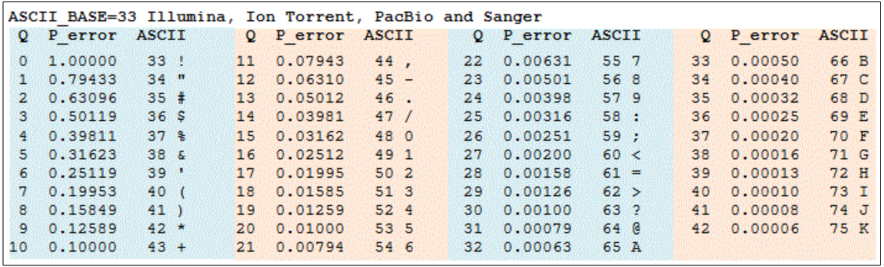

However, do note that the Qscore set for filtering *Pass* vs *Fail* reads filter based on the **average Qscore for the entire read**, and not based on individual Qscores of each base within each read! Hence, even if the read has an average Qscore of above e.g. 20, there can still be individual bases/locations within a read that has Qscores that fall below the filter! This could depend on a variety of factors, including properties of the sequence itself, such as at locations of a single multiple repeated base, where we can expect the Qscore to be lower naturally.

[CUDA toolkit version 11.8]: https://developer.nvidia.com/cuda-11-8-0-download-archive
[figure below illustrates the basecalling process]: https://nanoporetech.com/platform/technology/basecalling
[**FASTQ**]: https://en.wikipedia.org/wiki/FASTQ_format
[image above]: https://compgenomr.github.io/book/fasta-and-fastq-formats.html
[table below]: https://www.drive5.com/usearch/manual/quality_score.html
