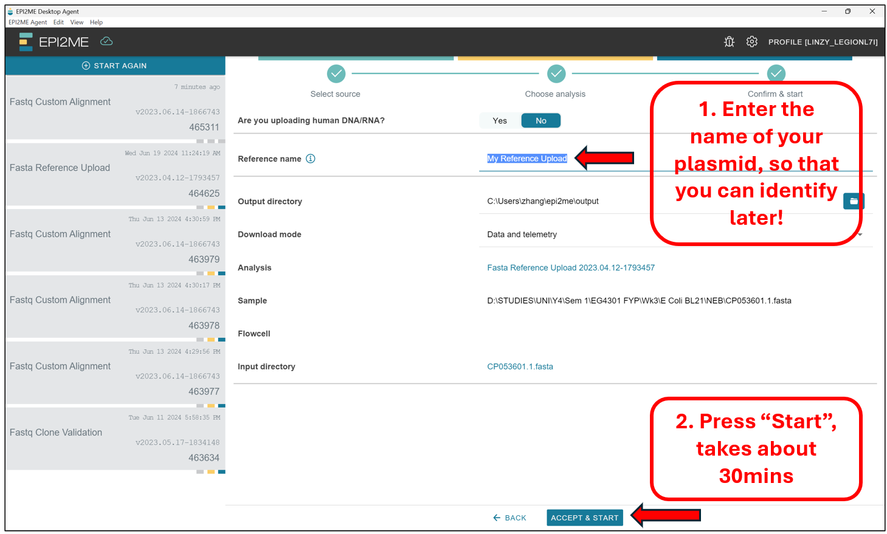
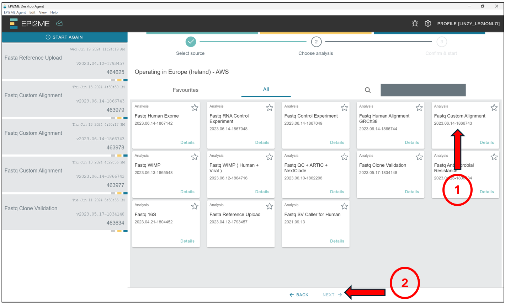
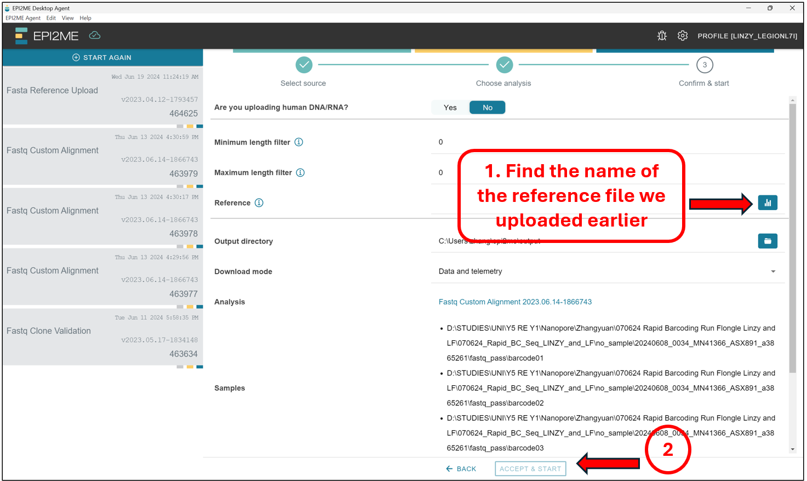
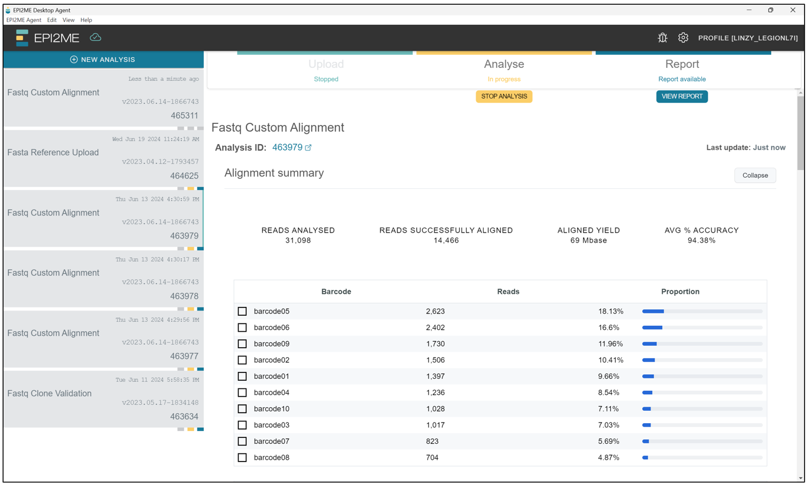
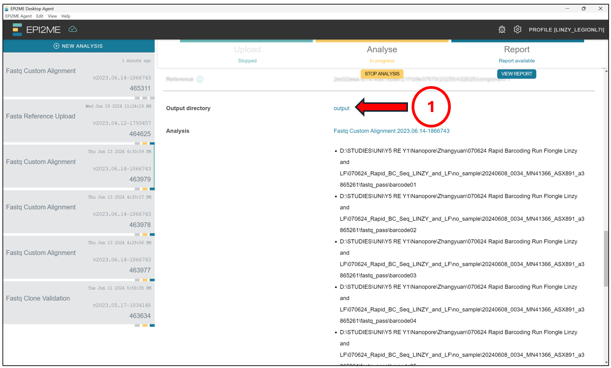
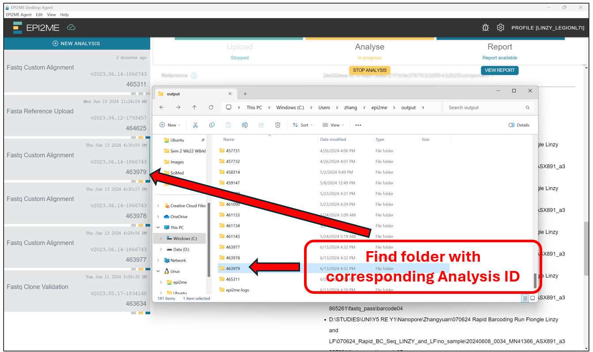
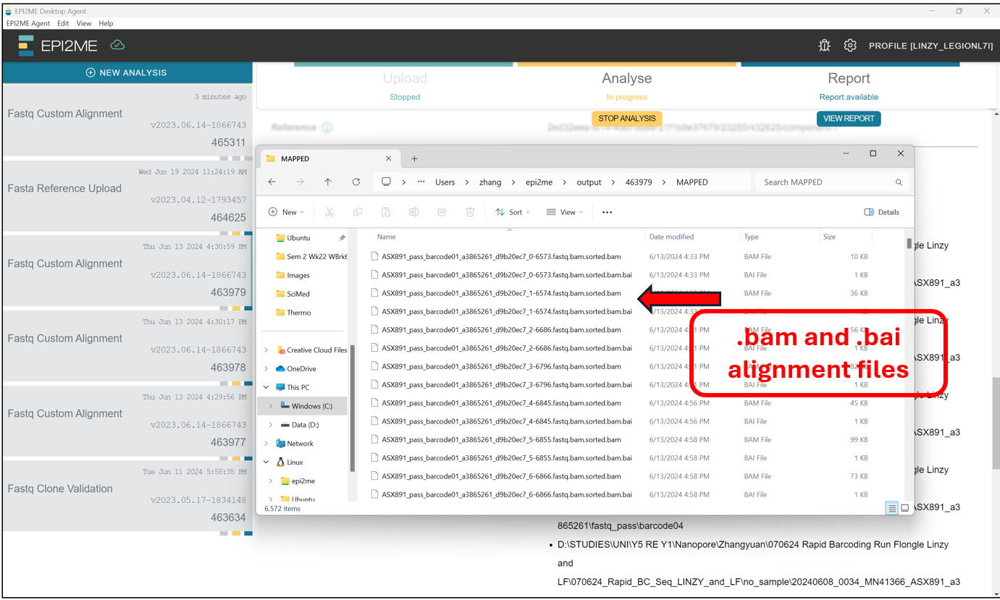

### Data Processing With GUI Programs

Now that we have sequenced our DNA samples on the Nanopore Sequencer, and obtained the raw data in the form of **FASTQ** files, we will most likely still need a way to analyse the data output (unless looking at thousands of lines of FASTQ output manually is your thing!). Typically to get useful information out of our sequencing data, these raw data will have to go through a *workflow* or *pipeline* of analysis/bioinformatics tools. Most of these *workflow* or *pipeline* will require some coding and/or work on the command line. However, there are also programs out there which require minimal coding and work on the command line by allowing the user to interact with Graphical User Interfaces (GUIs) -- these programs typically have the *workflow/piplines* hidden in the background behind the fancy looking GUIs and buttons, so that it looks less daunting to users with minimal coding experiences and/or are uncomfortable with using command line approaches; and who just want to get the work done.

One such GUI program is the EPI2ME suite of applications, maintained by EPI2ME labs that offers a collection of [Nextflow] based bioinformatics workflows tailored to Oxford Nanopore Technologies (ONT) long-read sequencing data. In this chapter, we will take a look at EPI2ME, and how we might use them in our lab -- specifically, to process the raw **FASTQ** data we just obtained from the previous chapter for the purposes of De novo plasmid assembly, and/or Sequence Alignment purposes; as depicted in the basic *workflow* mentioned previously in the previous chapter -- shown again below for reference.

Notes about the EPI2ME workflows explored in this chapter:
- **De novo sequence assembly**: Can be used to de novo assemble plasmid sequences etc. from the FASTQ sequencing data.
  - Note: Only samples containing a singular plasmid should use this analysis workflow on EPI2ME! If your sample contains more than one plasmid, it is best to do a custom alignment specific to the plasmid you are investigating.
- **Custom Alignment**: Can be used to align our sequencing data to a reference sequence. This step is useful for much of other workflows too!

### EPI2ME Versions

ONT currently offers two versions of EPI2ME. Shown on the left is the *EPI2ME Agent*, an older client which is meant to be retired end May 2024 (but somehow still works at the time of writing -- June 2024). Whereas shown on the right is the *EPI2ME Desktop* program, which is meant to replace *EPI2ME Agent*. *EPI2ME Agent* makes use of cloud based computing for processing the workflows (AWS), which means anyone can use it regardless of their computer's computing power. Whereas *EPI2ME Desktop* offers both cloud and local compute, although at the time of writing in June 2024, for most users it is currently limited to local compute, with cloud access limited to certain users only in closed beta.

 
For the remaining portions of this chapter, we will look at how we can use the EPI2ME programs for some of the most common use cases in our lab:
- De novo sequence assembly: Can be used to de novo assemble plasmid sequences etc. from the FASTQ sequencing data.
- - Note: Only samples containing a singular plasmid should use this analysis on EPI2ME! If your sample contains more than one plasmid, it is best to do a custom alignment specific to the plasmid we are interested at looking.
- Custom Alignment: Can be used to align our sequencing data to a reference sequence. This step is useful for much of other workflows too!


### EPI2ME Agent

> ## Scheduled to be discontinued
>
>  Note that this segment of the website will be removed once service on the *EPI2ME Agent* is confirmed to be officially discontinued, and thus not relevant!
> 
{: .warning}

In this segment, we will look at the use of the *EPI2ME Agent* for the two use cases mentioned above; which relies only on cloud based computing, making it possible for anyone to "run" their analysis on any computer.

#### De novo Plasmid Assembly

Starting from the *EPI2ME Agent's*"homepage", first press `New Analysis`, followed by `Select Folder(s)` to select the folder(s) containing the **BASECALLED** sequencing data -- This should be taken from the `"/fastq_pass"` folder, and should contain data in the **.fastq** format! Select those folders and press on `Next` to select the workflow we will be running.

Here we will select `Fastq Clone Validation`, and press `Next`.

Select `No` to the option "Are you uploading human DNA/RNA?". We should then see this screen. Thereafter, we will enter the estimated size of the plasmids we are expecting. This should be a value not more or less than 50% of the value indicated here. If you have samples with sizes much smaller than 50% of the value or 150% of the value indicated here, it will be best to rerun the analysis for those samples seperately in a seperate analysis!

Once the workflow starts, we should see a screen like this. Just leave the computer ON and let the program do its thing! This stage can take quite a while, depending on the network and how long it takes to upload the files onto the cloud.

Once the analysis is completed, we can `Stop` the `Upload` and `Anlysis` buttons on the top of the screen. We should see something like this. The results of succesful De novo assemblies are indicated as `Completed succesfully` under `Status`, whereas those which failed will be indicated as `Failed to ...`. The reasons for failure can vary, but usually it means there might be something wrong with our plasmid sample! It will be best to reanalyse through a custom alignment for the failed samples later on!

To access the output, scroll down from the screen above and click on `output`.

This should open up a File Explorer tab where all the EPI2ME analysis are stored by default. Find the folder with the corresponding `Analysis ID`.

In the folder with the corresponding `Analysis ID`, we should find the *.fasta* files for the samples where De novo assembly was succesfull. We can then take these *.fasta* files and upload them to benchling/BLAST etc for alignment!

#### Custom Alignment

For custom alignment of our sequencing data (*.fastq*) to a reference sequence, there are two steps required. 
- First will be to upload the reference sequence, which should be in a *.fasta* format. This can be easily downloaded from benchling etc! This step will generate a `.FAI` file, which is a **FASTA Index file** on the EPI2ME cloud, which will be needed for the actual alignment, but hidden from us. This only needs to be done once per reference sequence, and can be reused for multiple subsequent analysis and alignments! 
- Second will be the actual "custom alignment" to this reference sequence which we just uploaded.

#### Reference Upload

Starting from the *EPI2ME Agent's*"homepage", first press `New Analysis`, followed by `Select File(s)` to select the file containing the reference sequence -- This should be in **.fasta** format! Select the file and press on `Next` to select the workflow we will be running.

Here we will select `Fasta Reference Upload`, and press `Next`.

Select `No` to the option "Are you uploading human DNA/RNA?". We should then see this screen. Enter a name that will allow us to identify this reference sequence later, under the `Reference Name` option. Press `Accept & Start`, and leave the computer on. This portion may take as much as 30 minutes to complete.

Once this step is completed succesfully, we should see this screen saying `"WORKFLOW SUCCESSFUL"`.

#### Custom Alignment

Now we can proceed to the actual alignment. Again, Starting from the *EPI2ME Agent's* "homepage", first press `New Analysis`, followed by `Select Folder(s)` to select the folder(s) containing the **BASECALLED** sequencing data -- This should be taken from the `"/fastq_pass"` folder, and should contain data in the **.fastq** format! Select those folders and press on `Next` to select the workflow we will be running.

Here we will select `Fastq Custom Alignment`, and press `Next`.

Select `No` to the option "Are you uploading human DNA/RNA?". We should then see this screen. Under the `Reference` tab, find and select the name of the reference file we just uploaded and analyzed earlier. Do note that it could take a while before we see the reference file, depending on the server's speed!  Press `Accept & Start`.

When the workflow has completed, we should see a screen like this, showing the status of each sample we uploaded for custom alignment. 

Likewise with De novo assembly, to access the output, scroll down from the screen above and click on `output`.

This should open up a File Explorer tab where all the EPI2ME analysis are stored by default. Find the folder with the corresponding `Analysis ID`.

In the folder with the corresponding `Analysis ID`, we should find a collection of *.bam* and *.bai* files for the samples. These files contain the alignment information, and cannot be read manually by us, as they are in a binary format meant for the computer. To read them manually on Notepad and the like, they need to be in *.sam* format. However, we will leave that for later, after lunch!!!

### EPI2ME Desktop

FIXME

> ## Using EPI2ME Agent, upload and align XXX.
> 
> FIXME
> 
> > ## Solution
> >
> > ~~~
> > FIXME
> > ~~~
> >{: .bash}
> >
> {: .solution}
> 
{: .challenge}

[Nextflow]: https://www.nextflow.io/
