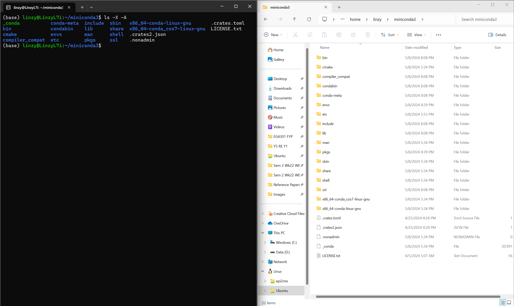

---
title: "Introduction to the Bash Shell"
teaching: 60
source: md
questions:
- "What is the bash shell?"
- "Why use the bash shell?"
- "How to use the bash shell?"
objectives:
- "Understand how the bash shell relates to the Operating System."
- "Explain when and why command line interfaces should be used."
- "Understand the basics of using the bash shell."
---

> ## Prerequisites
>
> From this point onwards, users should have a working Bash Shell setup!
> 
{: .warning}

### About Bash

We are all familiar with the use of Graphical User Interfaces (GUIs) - for most of us, we encounter and use them almost everyday in our lives, whether we know it or not! The moment we login into Windows, and open up File Explorer, Internet Browsers etc. we are already using a GUI. The use of GUIs make our interaction with computers intuitive and user-friendly, and may be great for those preferring a more visual approach. However they may also be less efficient, and may offer us less control over our systems. Our possible options and settings become limited to the "buttons" available for us to click and press. In spme specific niche use cases, GUI programs might not be available at all, or at least in the way we need! 

This is where Command Line Interfaces (CLIs) come to the rescue. While CLIs may be less user-friendly and accessible; and possibly daunting to use for the uninitiated. They often offer greater control and efficiency. With CLIs, we are presented a whole combination of commands and parameters to choose from -- instead of just being limited to the buttons available with GUIs. With CLIs, we can now also run a variety of specialized tools and resources! This can be especially relevant in bioinformatics, where the bulk of tools and programs are usually Command Line Programs rather than GUIs. In fact, even many GUIs based programs are still Command Line Programs, with a "graphical wrapper" placed over them (e.g. EPI2ME and certain workflows in MinKNOW)! These GUI based programs often offer less space for customisation of parameters, with many options hidden from the user -- compared to if they were to actually run the actual program or workflow on the Command Line!

For instance, if we were to try running basecalling seperately (via Analysis>Basecalling) after a sequencing run on the MinKNOW UI...

Compared to trying basecalling seperately using Guppy on the Command Line...

Notice how limited the run options on MinKNOW are compared to the options available on the command line! Most significant might be how there isn't even an option for read quality score filtering in MinKNOW here (defaults to qScore 10, which should be enough for most of us). The options presented on MinKNOW are just the essentials needed -- possibly to declutter the screen and make it easier to interact. Whereas on the command line there are so much more options available that one screen is not enough to list all the parameters -- and frankly could become a headache to read!

For this segment, note that the intention is to not make us experts at using the Bash Shell -- 1 Hour is probably not enough! Instead we will be going through the basics of the Bash Shell, and linking it as much as possible to GUIs, such as the Windows Explorer, so that it becomes less daunting for the beginner so that they can start using the other command line based data processing programs we will go thru for the later half of the workshop!

### Navigating Files and Directories

In Ubuntu, the Bash Shell serves as a powerful interface that links seamlessly with the underlying file system, facilitating efficient navigation, file management, and execution of commands and programs. This integration allows users to access, modify, and organize data across the file system hierarchy efficiently. To make life easier for us, I have enabled ourselves to view the files contained within the Ubuntu virtual machine -- if the instructions under the [**setup**] page has been followed succesfully.

Lets look at the parallels between the Ubuntu Bash Shell and what we can see within Windows File Explorer (I don't have a Mac, so I can only show Windows images here. But the concept should be the same! And the lab Nanopore Workstation computer is setup for Windows 11 and Ubuntu via WSL2 anyway so... :p). To look at the files and folders in the existing directory, we can use the command `ls` in the terminal. 

~~~
User$ 
User$ ls 
~~~
{: .bash}

In the example terminal above, the first line shows only a **prompt**, which indicates the shell is waiting for an input. The second line shows what we should see when we type in the command `ls`, where "User" would be whatever username you entered when you first setup the Ubuntu shell -- it is like the username of the account currently accessing the shell!

> #### Warning
>
> Take note not to type the prompt into the terminal (the `User$` portion)! Only type in the portion that follows after the `$`. This can be something to take note of when we copy and paste commands we find or Google on the internet!
>
{: .warning}

On the left is the Ubuntu terminal, where we can see the output from the commmand `ls -X -A` (not `ls` here!), and on the right we can see the files and folders available in the same directory where `ls` was entered, viewed from the windows file explorer. Notice the similarities between the two! In the Ubuntu terminal, folders are highlighted in blue, while the other files are highlighted in white (note other colors exist for other file types, just not shown here!)!

> #### Default Commands and Structure
>
> Note that by default 'ls' alone does not show files and entries starting with ".". You can try it for yourself! To show everything, we should use the flag (options/parameters/switches) `-a` or `--all`.
> To view all the available flags for a specific command/program, we can include flags like `-h` or `-H` or `--help` right after the command. 
>
> > ## Flag conventions: `-` versus `--` 
> >
> > Flags are like the options or parameters we can apply when running a program. They are usually indicated by a leading `-` or `--`, where `-` flags usually use a single letter which can be upper or lower-case (like `-h` or `-H`), whereas `--` flags usually use words (like `--help`). By common convention, one letter flags can be combined, so we can actually use `ls -XA` instead of `ls -X -A` in the example in the picture above to get the same results!
> > However, note that these conventions are not rules, and can/are often violated. They depend on the person who built the command/program/package!
> > 
> {: .idea}
>
> From the example command `ls -X -A`, we can observe a structure that almost all commands/entries into the terminal should follow.
> 1. The first portion is the **command** (like the program or function we want to run)
> 2. Next is the **flag(s)** (aka options/switches for the command/program)
> 3. Followed by an **argument(s)** (not shown here). This tells the command where and what to operate on, e.g. a specific file or folder)
> Note that both **flag(s)** and **argument(s)** are referred to as *parameters*. A command can usually be called with more than one **flag** and **argument**! But a commant doesn't always need an **arugment** or **flag**!
> Also, take note of the *space(s)* between commands and parameters, where necessary!
>    
{: .callout}

Now, lets look deeper at the file system on the Ubuntu terminal vs the Windows File Explorer, in relation to what we just did.

By default, the file system looks like this: 

### Basic Commands and Shortcuts

`pwd`: "Print Working Directory", shows us where we currently are within the file system.

### Pitfalls to Avoid

Copy pasting commands directly from the internet can sometimes be a bad idea! e.g. - vs -- 

[**setup**] : https://thatmantis.github.io/POH_Lab_ONT_NGS/setup.html
