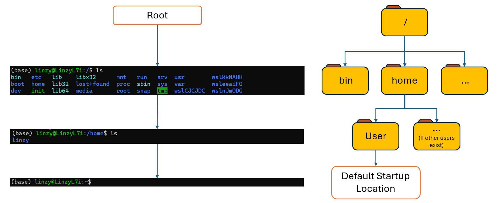

> ## Prerequisites
>
> From this point onwards, users should have a working Bash Shell setup!
> 
{: .warning}

### About Bash

We are all familiar with the use of Graphical User Interfaces (GUIs) - for most of us, we encounter and use them almost everyday in our lives, whether we know it or not! The moment we login into Windows, and open up File Explorer, Internet Browsers etc. we are already using a GUI. The use of GUIs make our interaction with computers intuitive and user-friendly, and may be great for those preferring a more visual approach. However they may also be less efficient, and may offer us less control over our systems. Our possible options and settings become limited to the "buttons" available for us to click and press. In spme specific niche use cases, GUI programs might not be available at all, or at least in the way we need! 

This is where Command Line Interfaces (CLIs) come to the rescue. While CLIs may be less user-friendly and accessible; and possibly daunting to use for the uninitiated. They often offer greater control and efficiency. With CLIs, we are presented a whole combination of commands and parameters to choose from -- instead of just being limited to the buttons available with GUIs. With CLIs, we can now also run a variety of specialized tools and resources! This can be especially relevant in bioinformatics, where the bulk of tools and programs are usually Command Line Programs rather than GUIs. In fact, even many GUIs based programs are still Command Line Programs, with a "graphical wrapper" placed over them (e.g. EPI2ME and certain workflows in MinKNOW)! These GUI based programs often offer less space for customisation of parameters, with many options hidden from the user -- compared to if they were to actually run the actual program or workflow on the Command Line!

For instance, if we were to try running basecalling seperately (via Analysis>Basecalling) after a sequencing run on the MinKNOW UI...

Compared to trying basecalling seperately using Guppy on the Command Line...

Notice how limited the run options on MinKNOW are compared to the options available on the command line! Most significant might be how there isn't even an option for read quality score filtering in MinKNOW here (defaults to qScore 10, which should be enough for most of us). The options presented on MinKNOW are just the essentials needed -- possibly to declutter the screen and make it easier to interact. Whereas on the command line there are so much more options available that one screen is not enough to list all the parameters -- and frankly could become a headache to read!

For this segment, note that the intention is to not make us experts at using the Bash Shell -- 1 Hour is probably not enough! Instead we will be going through the basics of the Bash Shell, and linking it as much as possible to GUIs, such as the Windows Explorer, so that it becomes less daunting for the beginner so that they can start using the other command line based data processing programs we will go thru for the later half of the workshop!

### Navigating Files and Directories

In Ubuntu, the Bash Shell serves as a powerful interface that links seamlessly with the underlying file system, facilitating efficient navigation, file management, and execution of commands and programs. This integration allows users to access, modify, and organize data across the file system hierarchy efficiently. To make life easier for us, I have enabled ourselves to view the files contained within the Ubuntu virtual machine -- if the instructions under the [setup] page has been followed succesfully.

Lets look at the parallels between the Ubuntu Bash Shell and what we can see within Windows File Explorer (I don't have a Mac, so I can only show Windows images here. But the concept should be the same! And the lab Nanopore Workstation computer is setup for Windows 11 and Ubuntu via WSL2 anyway so... :p). To look at the files and folders in the existing directory, we can use the command `ls` in the terminal. 

~~~
User: ~$ 
User: ~$ ls 
~~~
{: .bash}

In the example terminal above, the first line shows only a **prompt**, which indicates the shell is waiting for an input. The second line shows what we should see when we type in the command `ls`, where "User" would be whatever username you entered when you first setup the Ubuntu shell -- it is like the username of the account currently accessing the shell!

> ## Warning
>
> Take note not to type the prompt into the terminal (the `User$` portion)! Only type in the portion that follows after the `$`. This can be something to take note of when we copy and paste commands we find or Google on the internet!
>
{: .warning}

On the left is the Ubuntu terminal, where we can see the output from the commmand `ls -X -A` (not `ls` here!), and on the right we can see the files and folders available in the same directory where `ls` was entered, viewed from the windows file explorer. Notice the similarities between the two! In the Ubuntu terminal, folders are highlighted in blue, while the other files are highlighted in white (note other colors exist for other file types, just not shown here!)!

> ## Default Commands and Structure
>
> Note that by default 'ls' alone does not show files and entries starting with ".". You can try it for yourself! To show everything, we should use the flag (options/parameters/switches) `-a` or `--all`.
> To view all the available flags for a specific command/program, we can include flags like `-h` or `-H` or `--help` right after the command. 
>
> > ## Flag conventions: `-` versus `--` 
> >
> > Flags are like the options or parameters we can apply when running a program. They are usually indicated by a leading `-` or `--`, where `-` flags usually use a single letter which can be upper or lower-case (like `-h` or `-H`), whereas `--` flags usually use words (like `--help`). By common convention, one letter flags can be combined, so we can actually use `ls -XA` instead of `ls -X -A` in the example in the picture above to get the same results!
> > However, note that these conventions are not rules, and can/are often violated. They depend on the person who built the command/program/package!
> > 
> {: .idea}
>
> From the example command `ls -X -A`, we can observe a structure that almost all commands/entries into the terminal should follow.
> 1. The first portion is the **command** (like the program or function we want to run)
> 2. Next is the **flag(s)** (aka options/switches for the command/program)
> 3. Followed by an **argument(s)** (not shown here). This tells the command where and what to operate on, e.g. a specific file or folder)
> Note that both **flag(s)** and **argument(s)** are referred to as *parameters*. A command can usually be called with more than one **flag** and **argument**! But a commant doesn't always need an **arugment** or **flag**!
> Also, take note of the *space(s)* between commands and parameters, where necessary!
>    
{: .callout}

Now, lets look deeper at the file system on the Ubuntu terminal vs the Windows File Explorer, in relation to what we just did.

For example, the structure of a file system looks like this: 

The left side depicts what one might see at each stage of their file system from the Ubuntu Terminal, while the right side depicts the file system at each layer. 

Starting form the top is the **root directory** that holds everything. This is indicated by the leading slash `/` in `user:/$`.

Inside the **root directory** contains several other directories, such as `bin` (where some build-in programs are stored) and `home` (where users' personal directories are stored). In the image above, only one user exists in this Ubuntu virtual machine.

Going into `/home` and inside the **user directory** (`linzy` in the example above) is usually the default working directory when we first launch or open an Ubuntu terminal. This location and its downstream folders is where we will usually be storing our data, or running and installing commands from. This location is indicated by the `~` in the prompt `user:~$`.

> ## Slashes, spaces and other characters.
> ### Slashes
> Notice that there are two meanings for the `/` character.
> When it appears at the front of a file or directory name, e.g. `/home` it takes reference to the root directory. When it appears *inside* a name or directory, it separates directories, or files from upstream directories, e.g. `/home/linzy` seperates `linzy` from `home` and `root`.
> *This is why we usually cannot use `/` (and certain other characters) when naming files and directories.*
>
> ### Spaces
> The use of spaces when naming files and folders, especially in a command line interface setting is usually discouraged, as spaces are usually used to seperate **commands** from **flags** and **arguments**. To seperate words in a file name or folder, people usually use a combination of letters (e.g. upper and lower cases, e.g. PohLab), or characters such as `-` and `_`. However this does not mean spaces can't be used! Just that to name the folder or file, we will now need to include quotation marks `" "` to name them, e.g. for a file name `Poh Lab`, we will now need to type it in as `"Poh Lab"` in the terminal. You should be able to try this later!
> 
{: .warning}

### Basic Commands and Shortcuts

Now that we have a basic understanding of what the Bash Shell is, and how it relates to the file system and what we see on GUIs such as the Windows File Explorer, we can move on to some basic commands and shortcuts that you might commonly need to encounter in your line of work. 

### Useful Flags to Take Note

`-h` or `-H` or `--help`: Used to show a list of possible parameters for a command. If unsure of what a command/program does, this should be one of the first things you type in behind the command!

### File System Related Commands

- `pwd`: "Print Working Directory", shows us where we currently are within the file system.

- `ls`: Show the files and folders in the current working directory

- `cd`: Change to a **downstream folder** from the current working directory

- `cd ~`: Change to **User's Home Directory**
- `cd ..`: Change to the upstream directory
- `cd -`: Change to the previous directory I was in

- `mkdir`: Create a new folder within the current working directory

- `rm`: Remove a file/folder

### Other Commands

- `echo`: Similar to a "Print" command on Python etc.

### Shortcuts

- `"tab"`: A shortcut to help fill in the full name of a file/folder, used by first typing parts of the name of a file/folder until the system can recognise one file/folder from the next, such as if two file/folders have a common portion in their name. E.g. `file_1_abcdefg` and `file_2_abcdefg`. By typing `file_1` and pressing `"tab"`, the system will automatically fill in `_abcdefg` for us

- `Ctrl-C` or `Cmd-C`: **Keyboard Interupt**, used to terminate a running program/script and return the control to the user. Usually used when a program/script/code is hanging the system, such as during an infinite-loop

- `"right-click"`: **pasting**, equivalent to "Ctrl-V" or "Cmd-V" on the terminal, as physically pressing "Ctrl-V" or "Cmd-V" while in the terminal means something else!

- `*`: Two functions. 
- 1. `*` alone indicates all files/folders in the current working directory
- 2. Having a letter upstream/downstream indicates all files/folders that have the same name as what has been typed
- - `*abc`: refers to all files/folders with a name that ends with "abc", regardless of whatever is before it. e.g. "1_abc", "2_abc", "1234567890_abc" etc will all be highlighted
- - `abc*`: refers to all files/folders with a name that starts with "abc", e.g. "abc_1", "abc_2", "abc_12345abc" etc
- - `*abc*`: a hybrid of the two, e.g. "12345_abc_asdtf", "asd_abc_123sada", "abc" etc.   

### Loops

> ## Pitfalls to Avoid
>
> Be careful when directly copying and pasting commands directly from the internet .e.g from forums! This is because depending on the font/languages etc and how the webpage is rendered, certain characters can look very much alike like another character, yet mean something completely different, and someone might type the wrong character accidentally! And if we directly copy and paste, we might not be able to see it! One example might be "-" vs "--"
> `-`: "-"
> `--`: "--"
> Notice how they might look similar, depending on the font and how the page is rendered, sometimes it can be very difficult to tell them apart.
>
{: .warning}

> ## Absolute vs Relative Paths
>
> Starting from `/Users/amanda/data/`,
> which of the following commands could Amanda use to navigate to her home directory,
> which is `/Users/amanda`?
>
> 1. `cd .`
> 2. `cd /`
> 3. `cd /home/amanda`
> 4. `cd ../..`
> 5. `cd ~`
> 6. `cd home`
> 7. `cd ~/data/..`
> 8. `cd`
> 9. `cd ..`
>
> > ## Solution
> > 1. No: `.` stands for the current directory.
> > 2. No: `/` stands for the root directory.
> > 3. No: Amanda's home directory is `/Users/amanda`.
> > 4. No: this goes up two levels, i.e. ends in `/Users`.
> > 5. Yes: `~` stands for the user's home directory, in this case `/Users/amanda`.
> > 6. No: this would navigate into a directory `home` in the current directory if it exists.
> > 7. Yes: unnecessarily complicated, but correct.
> > 8. Yes: shortcut to go back to the user's home directory.
> > 9. Yes: goes up one level.
> {: .solution}
{: .challenge}

[setup] : https://thatmantis.github.io/POH_Lab_ONT_NGS/setup.html
