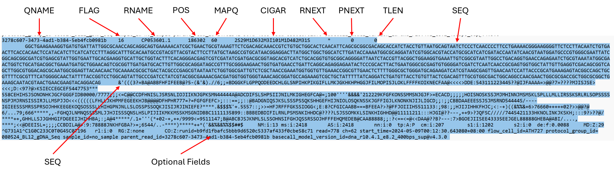
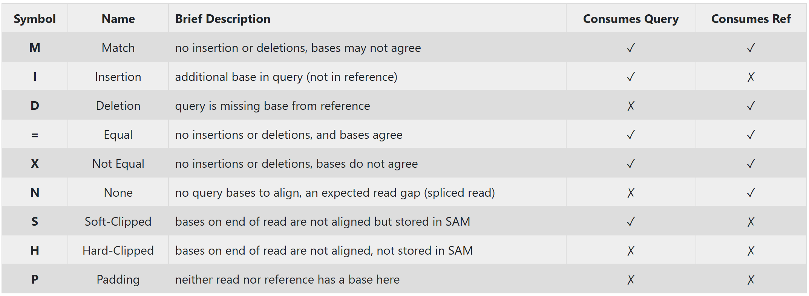
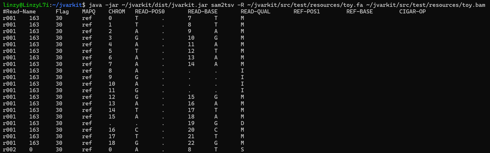

### BAM, BAI and SAM Files
From the EPI2ME *"Fastq Custom Alignment"* analysis we went through earlier, we will have received a bunch of **.BAM** and **.BAI** files earlier -- with each set corresponding to each **.FASTQ** raw data file we uploaded earlier. These are files containing information for each individual read and its alignment to the genome. However, we will not be able to view the information in a .BAM file directly, as the .BAM file actually contains data in a compressed binary format for the computer to read; with the corresponding .BAI file being like a "companion" file containing the indexes to the corresponding .BAM file. This reduces the size and allows for indexing, which enables efficient random access of the data contained within the file -- and is the format usually required for most programs for downstream processing and visualisation.

However, if we will like to view the raw alignment files manually, we can do so by converting it to a **.SAM** file, which is a tab-delimited text file containing the information from the corresponding .BAM files. The code below will convert all .BAM files in the current directory into .SAM files in a downstream directory `./sam` through a "for loop".
1. `NAME=$(basename $file .bam)`: This allows us to extract the name of the file without the file extensions prefixes ".fastq.bam.sorted.bam", so that we can keep the length of the name of our downstream files smaller.
2. `samtools view`: This is the `samtools` sub-command used for viewing and converting BAM and SAM files.
3. `-h`: This option includes the header in the output SAM file.
4. `-o ./sam/${NAME}.sam`: This specifies the output file name, to be placed in a downstream directory ./sam.
5. `$file`: This is the input BAM file you want to convert, designated by the `file` in the first line of the for loop `for file in ./*.bam `.

~~~
# Change to our working directory and make a downstream folder ./sam
cd ~/ngs_workshop/visualising/465981_R10_BL21/MAPPED
mkdir sam

# The for loop that converts each .bam/.bai file to a .sam file.
for file in ./*.bam 
do
  NAME=$(basename $file .fastq.bam.sorted.bam)
  samtools view -h -o ./sam/${NAME}.sam $file
done
~~~
{: .bash}

An example entry from a .SAM file is shown in the image below with the various fields highlighted. More information regarding the specification can be found in this paper by [Heng Li et al.].
1. QNAME: Query template name, aka. Read-ID/Read-Name
2. FLAG: Indicates alignment information about the read. Refer to this [tool] to decode a given SAM flag value. 
3. RNAME: Reference sequence name, which can also be a particualr chromosome/transcript ID.
4. POS: Position in the reference sequence aligning to the first base of the read. 
5. MAPQ: Mapping Quality
6. CIGAR: CIGAR String; summary of alignment.
7. RNEXT: Reference sequence name of the primary alignment of the NEXT read. Not so relevant for Nanopore.
8. PNEXT: Position of the primary alignment of the NEXT read in the template. Set as 0 when the information is unavailable. Not so relevant for Nanopore.
9. TLEN: The number of bases covered by the reads from the same fragment. 
10. SEQ: Read Sequence
11. QUAL: Read Quality. With "*" meaning such information is not available.

#### CIGAR Strings

Among all the information presented in an alignment file shown above. One of the most useful information is found in the CIGAR String. CIGAR stands for Concise Idiosyncratic Gapped Alignment Report. And the CIGAR string itself is a compressed representation of how a query sequence aligns to a reference genome, and are used by the SAM/BAM file formats. 

The CIGAR string is made up of (Integer)(Symbol) pairs. For each query base, how it aligns to the reference is denoted by a single (symbol), and adjacent matching (symbols) are counted and collapsed for a more succint representation (i.e. `MMDDDDMMM` becomes `2M4D3M`). A quick summary of the CIGAR symbols can be found in the [image] below.

### IGV Viewer

Rather than viewing the alignment information of each read individually from a .SAM file. Most people will likely use a genome viewer/browser, such as the [IGV viewer], which is a stand-alone GUI browser that can be installed locally, allowing for fast access and ease of navigation and visualisation. In order to use IGV, we will need both the **reference sequence** (in .FASTA or .GB format, both of which can be downloaded from e.g. Benchling), and the **alignment files** (both .BAM and .BAI).
1. Open IGV.
2. Load our reference sequence file (.fasta or .gb) into IGV using the **"Load Genomes from File"** option under the "Genomes" tab.
3. Load both our .BAM and .BAI files using the **"Load from File"** option under the **"File"** tab.

> ## Merging .BAM and .BAI files
>
> As the nanopore sequencer naturally generates one .fastq (and hence one corresponding .bam and .bai) file about every 10 minutes, we will obtain many .bam and .bai files for just one sample. Opening all these will likely render us impossible to view the tracks properly in IGV. To solve this issue, we can merge all the .bam and .bai files for each sample together using the following commands in the command line. And then upload this single merged .bam and .bai file onto IGV for better clarity.
> 
> ~~~
> # E.g. if all the .bam and .bai files of the same sample are in each unique directory
> # We can first merge the .bam files
> samtools merge merged_file.bam *.bam
> # Followed by creating the .bai index file for the merged .bam file.
> samtools index merged_file.bam
> ~~~
> {: .bash}
>
{: .idea}

### SAM2TSV

[SAM2TSV] is another powerful tool that we can use to process (and visualise) the alignment files, by printing the alignments as a TAB delimited file -- which we can either save as a .tsv file, or pipe into our own other codes and pipelines for downstream data analysis. It is part of JVarkit, a set of more than 100 java-based tools for bioinformatics. This package has not been included in the installation script, due to potential issues with Java versions. Here, we will first install JVarkit from the command line:

~~~
sudo apt update
# Check if java is installed:
java -version
# Install java:
sudo apt-get install default-jre
sudo apt install openjdk-17-jdk
# Actual JVARKIT installation:
cd ~
git clone "https://github.com/lindenb/jvarkit.git"
cd jvarkit
./gradlew jvarkit
~~~
{: .bash}

Thereafter, we can call the SAM2TSV tool from any directory with the format below. The following command produces an example output from a toy-example included in the JVarkit package.

~~~
#from anywhere, using the "~":
java -jar ~/jvarkit/dist/jvarkit.jar sam2tsv -R ~/jvarkit/src/test/resources/toy.fa ~/jvarkit/src/test/resources/toy.bam

# Alternatively, instead of spitting the output directly onto the command line, we can pipe the output and save it as a .txt file with "> anything.txt", where "anything.txt" is the name of the .txt file etc, an ">" is used to pipe the output into this .txt file.
java -jar ~/jvarkit/dist/jvarkit.jar sam2tsv -R ~/jvarkit/src/test/resources/toy.fa ~/jvarkit/src/test/resources/toy.bam > anything.txt
~~~
{: .bash}

In the code above, `java -jar ~/jvarkit/dist/jvarkit.jar` is used to call the main JVarkit tool. The `sam2tsv` line tells the computer we specifically want to use the SAM2TSV program within the JVarkit tool packages. `-R ~/jvarkit/src/test/resources/toy.fa` points to the reference **FASTA** file, and `~/jvarkit/src/test/resources/toy.bam` points to the alignment **.bam** file. Note that the reference FASTA file also requires a `.dict` file, which although it is not indicated in the command above, is still required (though in the toy example above, it has already been included). We can generate a `.dict` file from any `.fasta` file using the line below:

~~~
# Generate .fai file first
samtools faidx Reference.fasta

# Generate .dict file, make sure the .dict file has the same name (minus the file extension) as the Reference.fasta file!
samtools dict Reference.fasta -o Reference.dict
~~~
{: .bash}

Looking at the output, we can see 10 columns of data. With each row corresponding to a single base, either coming from the Read sequence, or Reference sequence, or both. In each row, from left to right we have the:
1. `Read-Name`: Or the Read-ID of each read. Lines with the same `Read-Name` belong to the exact same strand of read (most of the time)
2. `Flag`: The SAM Flag value for the `READ-BASE` based on a given combination of properties for the read. Refer to this [tool] to decode a given SAM flag value. 
3. `MAPQ`: Alignment mapping quality.
4. `CHROM`: Referemce sequence name
5. `READ-POS0`: The position of the base in the read DNA-sequence, with index starting from "0"
6. `READ-BASE`: The nucleotide corresponding to the position in the read DNA-sequence
7. `READ-QUAL`: The quality of the base above
8. `REF-POS1`: The position of the base in the reference sequence the corresponding `READ-BASE` has been aligned to, with index starting from "1".
9. `REF-BASE`: The nucleotide corresponding to the position in the reference DNA-sequence
10. `CIGAR-OP`: The CIGAR string of the corresponding position/base in the alignment

Now, lets try on the merged .bam file we generated through EPI2ME earlier!

> ## Run SAM2TSV on our .bam files
> 
> Try running SAM2TSV on the merged .bam file we generated earlier!
> 
> > ## Solution
> > FIXME
> >
> > ~~~
> >
> > FIXME
> > 
> > ~~~
> >{: .bash}
> >
> {: .solution}
> 
{: .challenge}

[SAM2TSV]: https://jvarkit.readthedocs.io/en/latest/Sam2Tsv/
[tool]: https://broadinstitute.github.io/picard/explain-flags.html
[Heng Li et al.]: https://academic.oup.com/bioinformatics/article/25/16/2078/204688
[image]: https://timd.one/blog/genomics/cigar.php
[IGV viewer]: https://igv.org/doc/desktop/
