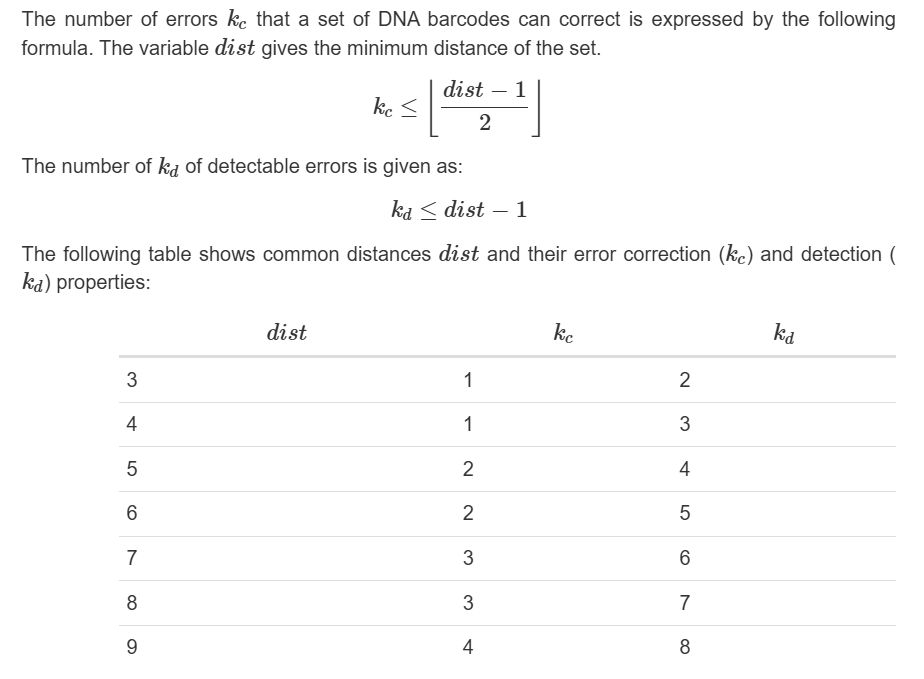

### Background for Exercise 1

For the remainder of this workshop, we will go through two exercises that makes use of these programs and concepts that we will introduce during the workshop, so that users can better follow and try to understand. Exercise 1 will cover content running from Chapters 06-Barcoding till 08-Variant Calling. While Exercise 2 will be covered in Chapter 09-Assembly, which will cover almost everything again and also serve as a recap.

For exercise 1, we will go through an imaginary experimental scenario utilising NGS for mutant library studies that makes use of **Variant Calling**. *E. coli* of undisclosed strain were transformed with a plasmid prepared with a mutant library of a particular gene of interest for the study. The samples were barcoded for multiplexing, and sequencing was thereafter conducted on Flongle flow cells on the MINion Mk1B platform, with basecalling conducted locally in real-time on the MinKNOW app. The data used for this exercise 1 can be found in the folder *vc* from the files provided. Raw basecalled sequencing data containing 4 distinct samples are merged and provided in *WkShop_VC.fastq* (pre-demultiplexed), with the list of barcodes used provided in *NP_WkShop_VC_BC_list.tsv*, and the reference wild-type gene sequence provided in *WkShop_VC_Reference.fasta*. Custom alignment was conducted with the reference wild-type gene sequence post-sequencing using the `Fastq Custom Alignment` workflow in EPI2ME Agent, and the subsequent alignment files (.bam and .bai), which we will use in Chapter 08-Variant Calling, are provided in the downstream folder *epi2me*.

There are generally two main approaches to variant calling workflows as shown in the flowchart below. The first approach is to run an alignment of the reads to the reference sequence before variant calling, as depicted by the flowchart on the left. While the second approach is to run an assembly based on the reads to obtain a consensus sequence prior to comparing it against the reference sequence for variant calling. For this exercise, we will do variant calling through the first approach so that we can make use of EPI2ME and minimise our work on the command line, to make it easier and more comfortable for the beginner.

We will first start off with multiplexing.

### Multiplexing

When running Next-Generation Sequencing (NGS) platforms, we often run multiple samples simultaneously in a single sequencing run -- known as multiplexing. This can be achieved by assigning unique molecular barcodes, such as DNA barcodes to each sample, enabling their identification and separation post sequencing. This allows for increased throughput, reduced costs (per sample) and improved efficiency by allowing us to obtain more data in less time. And is a particularly useful technique in large-scale studies, where high sample numbers are analyzed. Hence, multiplexing should almost always be done for our samples unless we require the absolute maximum sequencing depth for a particular sample or scenario.

Amongst the library preperation kits offered by ONT, [some of the kits] already include barcoding in one of their steps -- such as the [Rapid Barcoding Kits], and [Native Barcoding Kits]. These kits provides barcodes designed by ONT, and are automatically recognised and demultiplexed during sequencing in real-time by the MinKNOW app -- provided the right library preperation kit has been chosen during the run-setup. 

However, MinKNOW (and other ONT's basecalling programs, such as [Guppy]) can only automatically recognise and demultiplex these barcodes designed by ONT, and are incapable of recognising other custom barcodes that users might have designed on their own. Yet depending on the workflow, relying on such ONT library preperation kits for multiplexing might not always be practical or possible. 

In this imaginary experimental scenario for exercise 1, we were unable to solely rely on ONT's barcodes, as the amount of barcodes available from the library preperation kits are limited, and was also impractical to use due to the scale of this imaginary study. Hence multiplexing with our own custom designed barcodes were used instead. In this chapter, we will introduce how we can design our own barcodes and demultiplex them without relying on these ONT programs post basecalling. 

### 1. Barcode Generation

There are many ways and programs to generate our own custom barcodes, with each of them having their advantages and disadvantages. However, what might be more important is in knowing what to look out for, and the factors to consider when designing our custom barcodes. Perhaps one of the most critical factor is in ensuring the barcodes are completely orthogonal to one another, while still allowing us to account for possible sequencing errors when subsequently demultiplexing them. This can be done by taking into account the Sequence-Levenshtein distance when generating the barcodes. The [Sequence-Levenshtein distance] allows for read errors due to substitutions and indels, in contrast to perhaps the more well-known Hamming distance, which only accounts for read errors due to substitutions. Using the "Sequence-Levenshtein distance" is advised for PacBio/ONT Long Read sequencing technologies, as a large proportion of read errors includes indels; in contrast to mostly substitutions in Illumina short-read sequencers -- and thereby also resulting in more robust barcodes. The formula and some additional light-information for calculating the Sequence-Levenshtein distance is shown in the figure below, obtained from the vignette of the [DNABarcodes] Bioconductor package for R.

One way to generate DNA barcodes could be through the use of the [DNABarcodes] Bioconductor package for R. This can be done through a one-liner code, as shown below.
1. `10`: Sets the length of the barcode generated, as 10 base pairs.
2. `metric="seqlev"`: To use the "Sequence-Levenshtein distance" metric when generating the barcode.
3. `heuristic="ashlock"` : The heuristic ashlock is assumed to produce the best heuristic results with a reasonable parameter configuration. But it requires more computational power and time to run. An alternative is the `conway` heuristic which is the default heuristic.
4. `dist=5`: To set a "Sequence-Levenshtein distance" of at least 5 when generating the barcode.

~~~
mySeqlevSet <- create.dnabarcodes(10, metric="seqlev", heuristic="ashlock", dist=5)
~~~
{: .bash}

For this exercise, the barcodes have already been generated when preparing the *WkShop_VC.fastq* sample raw data.

### 2. Barcode Testing

After generating the barcode, we can do a quick test on the barcodes, and any additional sequences we might want to add or like to account for when doing the subsequent downstream demultiplexing. So as to ensure our "Sequence-Levenshtein distance" etc. are not violated when we eventually demultiplex them. To do so, we can make use of the [barcode package] on the command line -- which includes tools for generating barcodes, as well as for testing any other custom generated barcodes.

To test for the barcode, we will need to compile the list of barcodes into a single column, with one row/line for each barcode, into a `.txt` file. This has already been done and included in the *NP_WkShop_VC_BC_list_check.txt* text file. Run the following command in the command line:
1. `barcode test`: tells the computer we want to use the `test` function in the `barcode` package.
2. `-d 5`: checks the list of barcodes for a minimum Sequence-Levenshtein distance of "5".
3. `NP_WkShop_VC_BC_list_check.txt`: our input barcodes text file.
~~~
# first change into the right directory for Exercise 1
cd ~/ngs_workshop/vc
# Test barcode
barcode test -d 5 NP_WkShop_VC_BC_list_check.txt
~~~
{: .bash}

We should then see the output below, which confirms the barcodes we are using do not violate any distance constraints, up to at least a Sequence-Levenshtein distance of 5.

~~~
0 barcodes violate the distance contraint.
~~~
{: .output}

With that, we can safely move on with using that set of barcodes for our library preparation, and for downstream de-multiplexing!

> ## Try changing the distance parameter!
>
> Try changing the distance parameter and see what we get!
>
> > ## Solution
> >
> > When should still see `0 barcodes violate the distance contraint.`, until we try `-d 6` where we should then see the output:
> >
> > ~~~
> > 2 barcodes violate the distance contraint.
> > ~~~
> > {: .output}
> >
> {: .solution}
> 
{: .challenge}

### 3. Demultiplexing

Having obtained a good set of barcodes, we can then barcode our sample (such as by using barcoding primers through PCR) and library prep and sequence them. After having sequenced and basecalled the samples, we can then demultiplex our raw reads using the .Fastq file. The merged raw reads have been curated and merged into a single .Fastq file for this exercise in *WkShop_VC.fastq*.

Similar to barcode generation, any app/program etc. can be used for demultiplexing. Here, we will use the [demultiplex] program on the command line. To use the [demultiplex] program, we will need both the input raw *WkShop_VC.fastq* file, as well as a tab-seperated-value (TSV) file containing the labelled barcodes in NP_WkShop_VC_BC_list.tsv. As we will be using the `match` tool, we can provide both the forward and reverse barcodes in the .tsv file. However, do note here that the two barcodes for each sample should both be in the same direction (i.e. the sequence of the e.g. reverse primer used to generate the PCR amplicon should be reverse complemented here, so that both barcodes are in the same direction on the same strand!)!

The one-line command below should be able to demultiplex the reads into the 4 distinct samples accordingly.
1. `demultiplex match`: tells the computer we want to use the `match` tool from the `demultiplex` program.
2. `NP_WkShop_VC_BC_list.tsv`: the .tsv file containing our labelled barcodes -- with the "reverse" barcode being reverse complemented so both barcodes are in the same direction, on the same strand.
3. `-m 2`: to allow for `2` mismatches when demultiplexing. Note this is the number or errors, not the Sequence-Levenshtein distance itself!
4. `-d`: to use Sequence-Levenshtein distance when allowing for the mismatch when multiplexing.
5. `-f`: to allow the program to automatically classify any reads which are detected to belong to more than 1 sample into a separate file.

~~~
demultiplex match NP_WkShop_VC_BC_list.tsv WkShop_VC.fastq -m 2 -d -f
~~~
{: .bash}

After this, we should see the following files generated. The 4 samples are labelled `BC1` to `BC4`. Reads detected to have barcodes matching more than one sample are classified under `MULTIPLE` (possibly due to read errors etc.), and reads which do not have any of either 2 barcodes detected are classified under `UNKNOWN` (probably due to truncated reads etc).

~~~
WkShop_VC_BC1.fastq
WkShop_VC_BC2.fastq
WkShop_VC_BC3.fastq
WkShop_VC_BC4.fastq
WkShop_VC_MULTIPLE.fastq
WkShop_VC_UNKNOWN.fastq
~~~
{: .output}

With that, we have succesfully demultiplexed our raw sequencing .Fastq data into their respective 4 samples! And we may continue to the next step.

[some of the kits]: https://store.nanoporetech.com/sample-prep.html
[Rapid Barcoding Kits]: https://store.nanoporetech.com/rapid-barcoding-sequencing-kit-96-v14.html
[Native Barcoding Kits]: https://store.nanoporetech.com/native-barcoding-kit-24-v14.html
[Guppy]: https://community.nanoporetech.com/docs/prepare/library_prep_protocols/Guppy-protocol/v/gpb_2003_v1_revax_14dec2018/guppy-software-overview
[Sequence-Levenshtein distance]: https://bmcbioinformatics.biomedcentral.com/articles/10.1186/1471-2105-14-272
[DNABarcodes]: https://bioconductor.org/packages/release/bioc/html/DNABarcodes.html
[barcode package]: https://barcode.readthedocs.io/en/latest/usage.html
[demultiplex]: https://demultiplex.readthedocs.io/en/latest/usage.html
