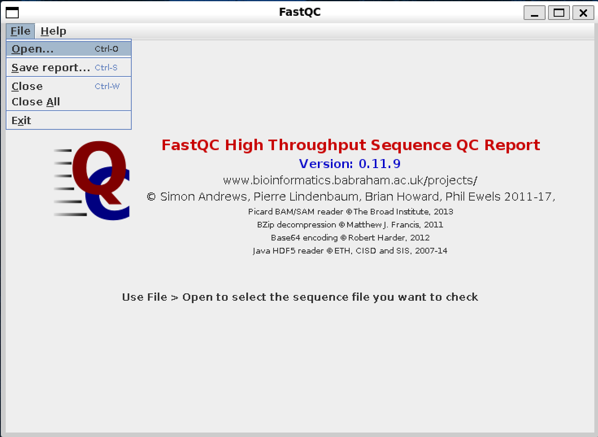
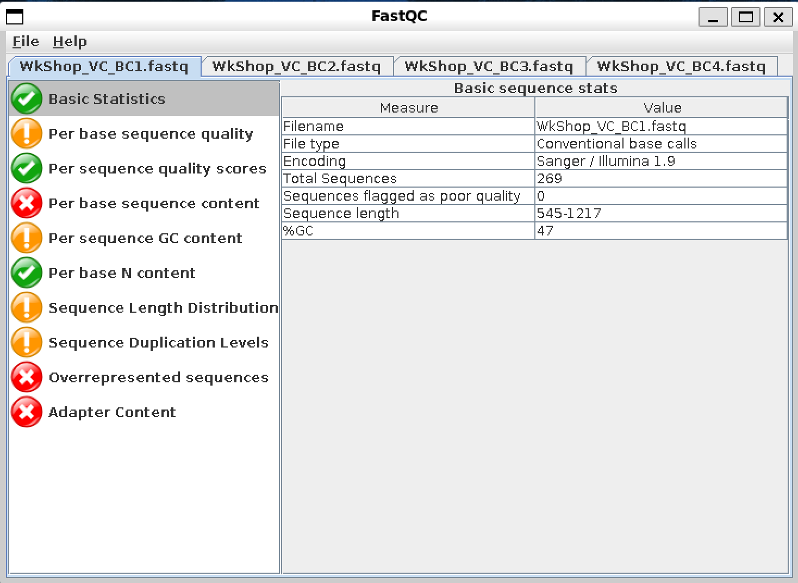

### 4. Quality Check

Usually the initial step after obtaining the raw FASTQ data (and demultiplexing them) is a quality control (QC) step. Doing so will give us some details of our sequencing data, such as the length and quality score (Qscore) distributions; as well as highlight potential problems with our sample, library preparation and/or the sequencing run itself. Some of these information can already be found in the MinKNOW app itself during/post sequenincg. However specialised QC tools and programs will provide more information. While there might be many tools available out there, in this workshop we will explore [FastQC] and [PycoQC].

#### FastQC

[FastQC] is one of the most common tools used for QC screening of sequencing data, and is usable for Illumina short-read sequencing platforms, as well as PacBio and ONT Long-read sequencing data. The input to FastQC are the raw (or post demultiplexed) .Fastq files, and it generates a visual report for each .Fastq file uploaded which allows us to gain a quick impression of any potential problems our data/sequencing might have, so that we can take these into consideration when doing further downstream analysis.

To use FastQC, we can either:
1. GUI: Type `fastqc` on the command-line to open it up as a GUI program and load in the Fastq files.
2. Command line: Using FastQC on the command line to generate reports in HTML format for each .fastq file, which we can subsequently open in a browser window etc. later.

##### FastQC on GUI

After typing in `fastqc` on the command line, it should open up as a GUI program in a seperate window. We can then upload one or multiple .Fastq file using the `Open` option under the `File` tab, as shown in the image below.

After uploading the .Fastq files, it will generate reports (depending on the number of .Fastq files we uploaded) as shown in the image below. Each FastQC report exists as a seperate tab that we can navigate at the top. We can click on the tabs on the right hand side to view each category in the report accordingly. Items/categories that might warrant attention are highlighted with either the Orange Exclamation Mark symbol, or the Red Cross symbol. 

##### FastQC on Command Line

To generate FastQC reports through the command line, we can enter the following lines of code. In `fastqc *.fastq -o ./fastqc`,
1. `*.fastq`: input, takes in all files with the .fastq extension in the current directory, regardless of name.
2. `-o ./fastqc`: output, generates a FastQC report for each .fastq file, in the directory ./fastqc one level down.

~~~
# Make sure we are in the right directory
cd ~/ngs_workshop/vc

# Create another directory in the current directory to store our fastqc reports
mkdir ./fastqc

# Generate the FastQC reports
fastqc *.fastq -o ./fastqc
~~~
{: .bash}

We can then view the FastQC reports by double clicking ont them in File Explorer, and it will typically open up in your system's default internet browser that we can view in.

> ## Take Note!
>
> Be aware that any features or “issues” flagged out (e.g. Over-represented sequences) may be “false positives”! Especially for small datasets or highly repetitive genomes/sequences! Just because a program flags it does not mean it is definitely an issue and has to be trimmed/cropped! Tools can only give us an indication of potential problems, we still need to know what we are looking for and practice our own discretion! Else we could fasely remove true variations etc.!
>
{: .warning}

#### PycoQC

[PycoQC] is another data visualisation and quality control tool, but specifially meant for ONT data, as it needs a specific *sequencing_summary.txt* file generated by ONT basecallers such as Guppy. Similar to FastQC, it generates a report in a .html format which we can easily open with any internet browser. But compared to FastQC, PycoQC focuses more about information regarding the sequencing run and the flow cell itself, such as the yield, output and quality over time, 

No *sequencing_summary.txt* file has been provided for this variant calling exercise. However, a *sequencing_summary.txt* has been provided for the second exercise of this workshop on Assembly, which we can take a look at.

1. `-f sequencing_summary_ATH727_a2b50ed3_b9fd1fba.txt`: the input *sequencing_summary.txt* file generated by the Nanopore sequencer
2. `-o R10_BL21_pycoQC.html`: the output PycoQC .html report file generated.

~~~
# Switch over to the folder meant for the Assembly excercise later on
cd ~/ngs_workshop/assembly

# Generate the pycoQC report.
pycoQC -f sequencing_summary_ATH727_a2b50ed3_b9fd1fba.txt -o R10_BL21_pycoQC.html
~~~
{: .bash}

### 5. Trimming

After conducting QC above, we can then perform trimming of reads based on the QC reports. Trimming can include filtering and cropping of short or low quality reads, removal of adapter sequencers, and also trimming low-quality parts of reads etc.

However (thankfully?) for most use cases, it might not be necessary to conduct our own further downstream data trimming. ONT's Barcodes and any adapters added during library preparation can/are automatically clipped and trimmed from the raw FASTQ data post sequencing during Basecalling in the MinKNOW app. The MinKNOW app also handles Qscore filtering and length filtering in real-time during sequencing. In the EPI2ME Applications which most users in this workshop will likely use for initial further downstream data processing (such as for De Novo plasmid assembly, or for custom alignment workflows), users can also easily choose to filter the reads used for analysis by length and Qscores as well.

Nevertheless, if users will still like to filter and trim their data manually, such as by length, they can run simple commands such as the one shown below from the Bash command line. 
1. `length(seq) >= 100`: trims off reads below 100bp.
2. `length(seq) <= 300`: trims off reads above 300bp.
3. `your.fastq`: input raw data file in FASTQ format.
4. `filtered.fastq`: output trimmed data file in FASTQ format.

~~~
awk 'BEGIN {FS = "\t" ; OFS = "\n"} {header = $0 ; getline seq ; getline qheader ; getline qseq ; if (length(seq) >= 100 && length(seq) <= 300) {print header, seq, qheader, qseq}}' your.fastq > filtered.fastq
~~~
{: .bash}

If users will still like to do triming and filtering of their raw data, such as by cropping off the head and tail sequences (which according to [some papers], generally posses lower Qscores for the first (head) and last (tail) ~130bp), they can do so with command line programs such as [nanofilt] and [chopper]. This head and tail cropping should be done at their own discretion. Users should also understand what they are trimming off, as blindly trimming and cropping off reads could potentially result in the loss of true variations and details.

Nevertheless, I personally find that for most of my applications (in microbiology, and relatively shorter read sequencing), especially when involving EPI2ME as part of the workflow, manual trimming is not required at all :) .

[FastQC]: https://www.bioinformatics.babraham.ac.uk/projects/fastqc/
[PycoQC]: https://a-slide.github.io/pycoQC/
[some papers]: https://journals.plos.org/plosone/article?id=10.1371/journal.pone.0257521
[nanofilt]: https://github.com/wdecoster/nanofilt
[chopper]: https://github.com/wdecoster/chopper
