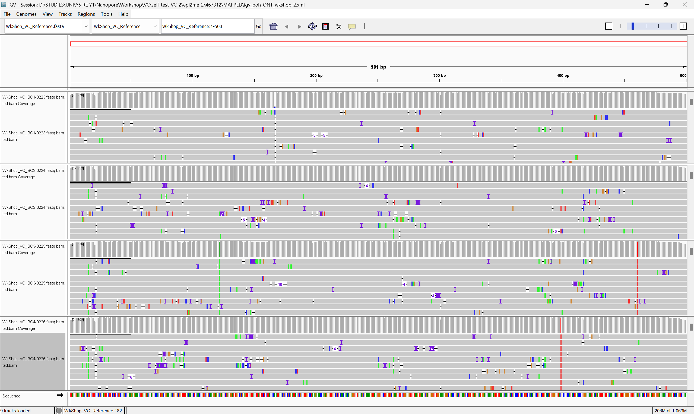

### 6. Alignment (and manual visualisation of variants)

After the conducting the Demultiplexing and QC steps from above, the next step in the workflow will be to do an alignment of the demultiplexed (and QC-ed) .Fastq files against the reference gene of interest sequence. For this step, we can rely on the `Custom Fastq Alignment` workflow in EPI2ME to do the alignment for us, so that we can have one less thing to be concerned about optimising :) . For this workshop, alignment has been pre-run on EPI2ME, and the .bam and .bai files may be found in the `./vc/epi2me` directory. We will use those files for the rest of this exercise. 

However, before we proceed further, you may wish to view the alignment files on IGV to know what kind of variants we may be expecting in our imaginary mutant library study. An image of what you should see for these 4 demultiplexed samples after aligning to the reference gene of interest and viewed on IGV is shown in the image below. 

And of course, if the sample size is small, users may choose to look at IGV to manually record the variants observed -- just as how some of you might have been doing traditionally for small scale mutangenesis studies sequenced by Sanger sequencing and viewed on Benchling/BLAST. 

### 7. Variant Calling.
