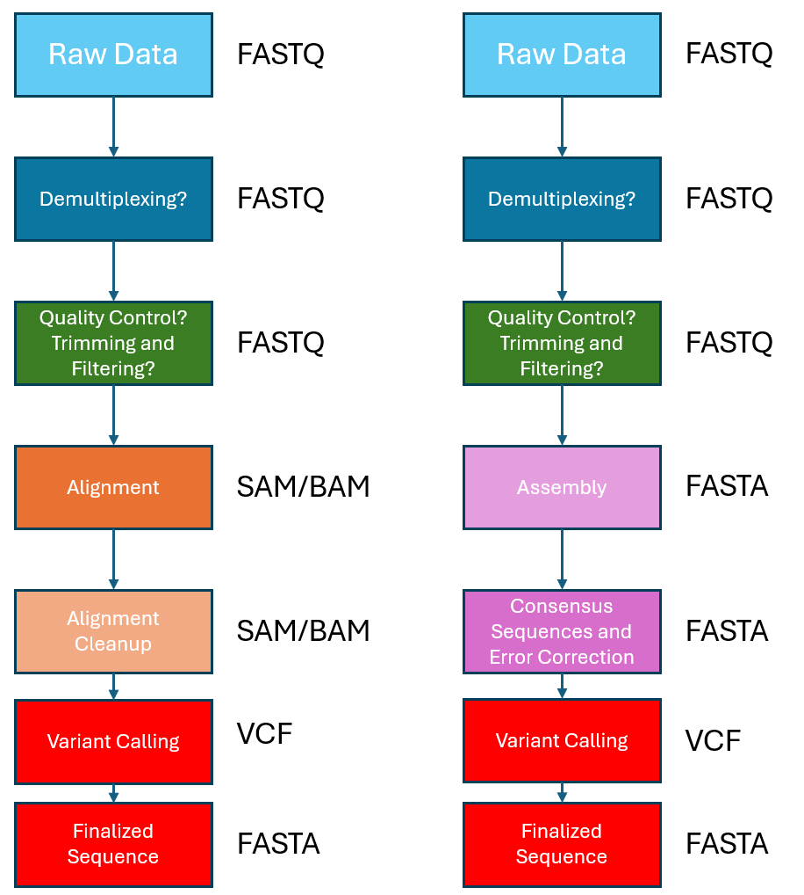
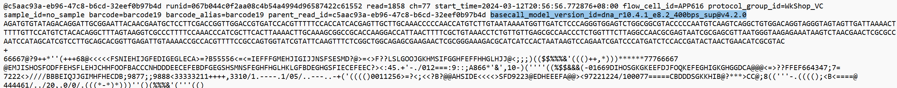
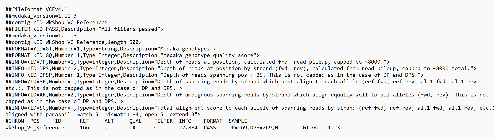
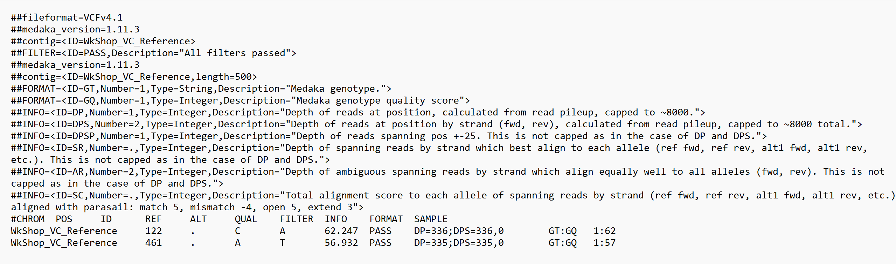

### 6. Alignment (and manual visualisation of variants)

After the conducting the Demultiplexing and QC steps from above, the next step in the workflow will be to do an alignment of the demultiplexed (and QC-ed) .Fastq files against the reference gene of interest sequence. For this step, we can rely on the `Custom Fastq Alignment` workflow in EPI2ME to do the alignment for us, so that we can have one less thing to be concerned about optimising :) . For this workshop, alignment has been pre-run on EPI2ME, and the .bam and .bai files may be found in the `./vc/epi2me` directory. We will use those files for the rest of this exercise. 

However, before we proceed further, you may wish to view the alignment files on IGV to know what kind of variants we may be expecting in our imaginary mutant library study. An image of what you should see for these 4 demultiplexed samples after aligning to the reference gene of interest and viewed on IGV is shown in the image below. 

From the image above, we can already clearly see what variants are present in each of our 4 samples. And of course, in an actual experimental workflow, if the sample size is small, users may choose to look at IGV to manually record the variants observed -- just as how some of you might have been doing traditionally for small scale mutangenesis studies sequenced by Sanger sequencing and viewed on Benchling/BLAST. But what if we are talking about large sequences of interest (such as in an entire genome), with hundreds of samples to look at? Lets imagine that is the case for now... :) .

### 7. Variant Calling.

Now that we have aligned the reads for each of the 4 individual demultiplexed sample to the reference sequence, we can move on with variant calling. A variant call is a conclusion that there is a nucleotide/sequence difference compared to a reference at a given position in an individual genome or transcriptome. The call is usually accompanied by an estimate of variant frequency and some measure of confidence. As mentioned previously, there are generally two main approaches to variant calling, as demonstrated in the image below. However, in this exercise we will explore the approach shown on the left, which relies on an alignment to the reference sequence, which we have done already via EPI2ME.

There are generally two types of variant calling. The first is in detecting sequence variants, often referred to as a Single Nucleotide Polymorphisms (SNPs). These generally include shorter variations at a single base pair level including insertions and deletions (INDELs) and transitions. Similar to the other steps in this exercise/workflow, there are many tools available for variant calling. In this workshop, we will explore [bcftools] -- which was originally developed for Illumina short-read sequencing analysis; and [medaka] -- which was developed specifically for ONT/long-read sequencing technologies.

The other type of variant calling is for detecting structural variants -- which generally covers larger variants ranging from 50bp and more, and can include larger variants, inversions, translocations etc; we will not be exploring that in this workshop. However if users are interested in exploring structural variants, they can look at [Sniffles], which is a structural variant caller meant for long-read sequencing.

### 7.1. BCFtools

#### Step 1. Sort BAM file by coordinates

From the .bam and .bai files output from EPI2ME (or whatever aligner you used), we will sort the BAM file using the `sort` command from `samtools`. the `-o` parameter tells the command where to write the output.

~~~
# We will first go to the folder containing the EPI2ME aligned .bam and .bai reads, and make a new directory inside to store our resorted reads.
cd epi2me
mkdir resorted

# Sorting BAM file by coordinates.
for file in ./*.fastq.bam.sorted.bam
do
	NAME=$(basename $file .fastq.bam.sorted.bam)
                 echo $NAME
                 samtools sort ./${NAME}.fastq.bam.sorted.bam -o ./resorted/${NAME}.resorted.bam
done

#index resorted bam files (change directory to ./resorted)
cd ./resorted
for file in ./*.bam
do 
samtools index $file
done
~~~
{: .bash}

Note that SAM/BAM files can be sorted in many ways, e.g. by location of alignment on the reference sequence, by read-name etc. It is important to be aware that different alignment tools will output differently sorted SAM/BAM files, and downstream tools require differently sorted alignment files as input! By default, the EPI2ME aligned .bam and .bai reads seem to be already sorted by location and read name, and can be used directly downstream for variant calling with BCFtools. However, it is still good to sort the file ourselves so that we can be sure of their contents.

#### Step 2. Calculating the read coverage of positions in the genome

We will first calculate the read coverage with [bcftools]. We will use the command `mpileup` which is used to generate a pileup file format output from BAM files. This pileup format is a format that essentially summaries the bases and their qualities at each position of the reference genome, and is often used as an input for variant calling.

~~~
# Make a new directory to store the pileup files.
mkdir vcf_bcftools

# Running mpileup. TAKE NOTE TO HAVE WkShop_VC_Reference.fasta REFERENCE SEQUENCE FILE AVAIALABLE!
for file in ./*.bam
do
bcftools mpileup -O b -o ./vcf_bcftools/$file.bcf \
        -f WkShop_VC_Reference.fasta $file 
done
~~~
{: .bash}

#### Step 3. Detecting the Single Nucleotide Polymorphisms (SNPs)

Now, we will identify the SNPs using the bcftools `call` command. We will specify ploidy with the flag `--ploidy`, which is one for the haploid E. coli. `-m` allows for multiallelic and rare-variant calling, `-v` tells the program to output variant sites only (not every site in the genome), and `-o` specifies where to write the output file:

~~~
# Change to the directory containing the pileup files, and make a new directory to store the vcf files.
cd vcf_bcftools/
mkdir variants

for file in ./*.bcf
do
bcftools call --ploidy 1 -m -v -o ./variants/$file.vcf $file 
done
~~~
{: .bash}

#### Step 4. Filter and report the SNP variants in variant calling format (VCF)

We will now filter the SNPs for the final output in VCF format, using `vcfutils.pl`, which is also a tool from bcftools. Here, we also specifically specify to filter out called variants with a Qual score less than 50.

~~~
# Change to the directory containing the vcf, and make a new directory to store the filtered vcf files.
cd variants
mkdir final_variants_filtered

for file in ./*.vcf
do
vcfutils.pl varFilter $file > ./final_variants_filtered/$file.vcf
bcftools filter -e 'QUAL<50' ./final_variants_filtered/$file.vcf -o ./final_variants_filtered/$file.vcf
done
~~~
{: .bash}

And now, we should have the following .vcf files for our 4 individual samples. Refer to the bottom of this page for more information about the .vcf file format!

~~~
WkShop_VC_BC1-0002.resorted.bam.bcf.vcf.vcf
WkShop_VC_BC2-0003.resorted.bam.bcf.vcf.vcf
WkShop_VC_BC3-0004.resorted.bam.bcf.vcf.vcf
WkShop_VC_BC4-0005.resorted.bam.bcf.vcf.vcf
~~~
{: .output}

> ## Take a look at the .vcf files!
>
> What variants were detected that we can see from these .vcf files? And how do they compare against what we had initially expected to see on IGV earlier?
>
> > ## Solution
> >
> > The sample BC2 has no variants detected, while sample BC3 has 2 variants, and sample BC4 has 1 variant detected -- all 3 of which are what we can expect when we view the .bam alignment files on IGV. However, the INDEL at reference position 167 which we can view on IGV is not detected by this variant calling pipeline! It seems like BCFTools has difficulties with detecting short INDELs below 20bp.
> >
> {: .solution}
> 
{: .challenge}

#### Step 5. Consensus Calling

We can now apply the called and filtered variants to create a consensus sequence!

~~~
# First, we will gzip the .vcf files and index them, using bgzip
mkdir gunzipped
for file in ./*.vcf
do
bgzip -c $file > ./gunzipped/$file.gz
done

# Second, we will index these gzip files
cd gunzipped
for file in ./*.gz
do
bcftools index $file
done

# Finally, we generate the consensus sequence. TAKE NOTE TO HAVE WkShop_VC_Reference.fasta REFERENCE SEQUENCE FILE AVAIALABLE! 
mkdir consensus
for file in ./*.resorted.bam.bcf.vcf.vcf.gz
do
NAME=$(basename $file .resorted.bam.bcf.vcf.vcf.gz)
echo $NAME
cat  WkShop_VC_Reference.fasta | bcftools consensus ./${NAME}.resorted.bam.bcf.vcf.vcf.gz > ./consensus/${NAME}.consensus.fa
done
~~~
{: .bash}

We should now have 4 consensus .fasta files, one for each of the 4 distinct samples that we demultiplexed earlier, with the variants detected and called using bcftools from step 4 above applied!

### 7.2. Medaka

[medaka] is another tool specifically designed for polishing nanopore data and which we can use for variant calling and generating consensus sequences. Unlike BCFTools, it performs the analysis using neural networks applied against a pileup of individual sequencing reads against a draft assembly -- which enables state-of-the-art results outperforming sequence-graph based methods and signal-based methods, whilst also being faster (compared to many other variant callers out there), albeit more computationally intensive than BCFTools.

In contrast to BCFTools which relies on .bam and .bai files generated by alignment to a reference sequence, Medaka only requires the (demultiplexed) .Fastq (or .Fasta as an alternative) "raw" basecalled file, and the reference sequence as a .Fasta file.

We will first need to install Medaka, which was not included in the install.sh shell script due to the extensive dependencies required and potential complications that could occur. Instead, we will make use of the conda/mamba etc package managers and install Medaka in a new environment so as to eliminate any potential clashes with other softwares.

~~~
# Create a new conda environment "medaka", and install the Medaka package.
conda create -n medaka -c conda-forge -c bioconda medaka
~~~
{: .bash}

#### Step 1. Variant Calling

Unlike the long list of codes needed for variant calling with BCFTools, we just need a "single line" of code, by using the `medaka_haploid_variant` workflow. The `medaka_haploid_variant` workflow runs variant calling with ploidy = 1 for bacterial samples. Whereas the `medaka_variant` can be used for diploid variant calling. We define the input .fastq/.fasta file with `-i`, the reference .fasta file with `-r`, and the output file (and its location) with `-o`. The basecall model version is defined with `-m`, and can be checked by looking at the header line of each .fastq file. For these samples, we will use `-m r1041_e82_400bps_sup_variant_v4.2.0`, as depicted in the screengrab below.

~~~
# Change to the directory containing the .fastq sequencing files and .fasta reference files.
cd ~/ngs_workshop/vc
mkdir medaka

for file in ./*BC*.fastq
do
medaka_haploid_variant -i $file -r WkShop_VC_Reference.fasta -o ./medaka/$file -m r1041_e82_400bps_sup_variant_v4.2.0
done
~~~
{: .bash}

However, we will see that each output has been stored in an individual folder, with the actual .vcf file named plainly as `medaka.annotated.vcf`. We shall now rename each of the `medaka.annotated.vcf` files according to the name of the folder containing it, and store them in a seperate folder "medaka".

~~~
cd medaka
mkdir VCF

for folder in ./WkShop_VC_BC*/
do
base_name=$(basename "$folder")
echo $basename
cp "${folder}/medaka.annotated.vcf" "./VCF/${base_name}.vcf"
done
~~~
{: .bash}

#### Step 2. Consensus Calling

Similar to the .vcf files generated with BCFTools above, we can also follow the code in BCFTools Step 5 above to use the .vcf files we generated through Medaka for consensus calling. Alternatively, Medaka is able to generate the consensus sequences itself independent of the .vcf files. Again, all we need is the .fastq/.fasta sequencing files and .fasta reference files. Using the `medaka_consensus` workflow, the

~~~
# Create consensus .fasta sequences
mkdir medaka_consensus
for file in ./*BC*.fastq
do
medaka_consensus -i $file -d WkShop_VC_Reference.fasta -o ./medaka_consensus/$file -m r1041_e82_400bps_sup_variant_v4.2.0
done

# Rename the generated "consensus.fasta" files into their respective sample names, similar to what was done above with Variant Calling using Medaka.
cd medaka_consensus
mkdir consensus
for folder in ./WkShop_VC_BC*/
do
base_name=$(basename "$folder" .fastq)
echo $base_name
cp "${folder}/consensus.fasta" "./consensus/${base_name}_consensus.fa"
done
~~~
{: .bash}

### VCF Format

We can open the .vcf files we have generated above using a text editor. Here, we will show the screengrab of the samples BC1, which contains 1 INDEL, and sample BC3, which contains 2 SNPs.

Sample BC1:

Sample BC3:

In the .vcf files, we will see the a few information (marked with 2 hashes, `##`) at the top. Amongst this information, first is the header, which defines that the file format is a VCF file. This are followed by the time and date the file was created, the version and program used to generate the VCF files, the command line parameters used, as well as some other additional information.

The actual information on the variations called are at below these information headers, starting with `#CHROM`. The content of these actual output are as below. Ideally, the information in the first 7 columns will be enough for most use cases.
1. `CHROM`: The name of the reference sequence; or the name of the chromosome etc in larger reference files where multiple chromosomes are present.
2. `POS`: Position within the reference sequence where the variation occurs
3. `ID`: Usually a `.`, until we add annotation information 
4. `REF`: The reference genotype
5. `ALT`: The alternate (variant called) genotype in our reads 
6. `QUAL`: Phred-scaled probability that the observed variant exists at this site (higher is better)
7. `FILTER`: A `.` if no quality filters have been applied. A `PASS` if a filter is applied, and/or the name of the filters this variant failed.
8. `INFO`, `FORMAT`, `SAMPLE`: Additional information (on the variants etc). For more information, refer to the [documentation for the VCF v4.2 file format].

> ## Note about QUAL scores
>
> Take note that different variant callers will produce a different QUAL score! For instance, compare the QUAL score of the variants in the filtered .vcf file generated using BCFTools vs the .vcf file generated using Medaka!
> 
{: .warning}

Alternatively, we can also use IGV to view the called variants -- which might be more useful in a larger genome! To do so, open IGV and load the reference genome file (.fastq or .gb) and alignment files (.bam and .bai), as mentioned in the previous chapter on Visualising Data. The .vcf files can be loaded the same way, using the **"Load from File"** option under the **"File"** pull down menu, just as we have done with the alignment .bam and .bai files. 

[bcftools]: https://samtools.github.io/bcftools/
[medaka]: https://github.com/nanoporetech/medaka
[Sniffles]: https://github.com/fritzsedlazeck/Sniffles
[documentation for the VCF v4.2 file format]: https://samtools.github.io/hts-specs/VCFv4.2.pdf
