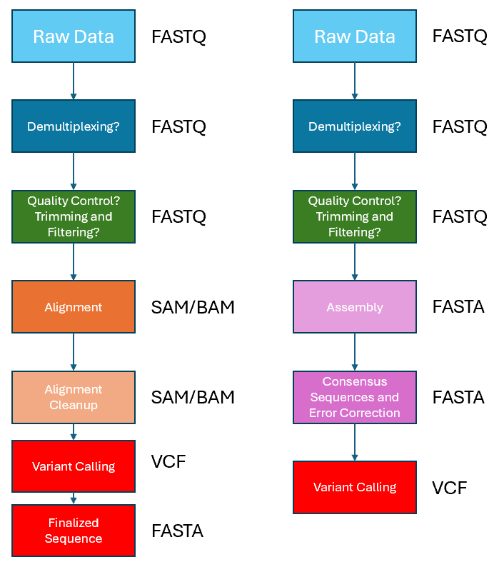

### 6. Alignment (and manual visualisation of variants)

After the conducting the Demultiplexing and QC steps from above, the next step in the workflow will be to do an alignment of the demultiplexed (and QC-ed) .Fastq files against the reference gene of interest sequence. For this step, we can rely on the `Custom Fastq Alignment` workflow in EPI2ME to do the alignment for us, so that we can have one less thing to be concerned about optimising :) . For this workshop, alignment has been pre-run on EPI2ME, and the .bam and .bai files may be found in the `./vc/epi2me` directory. We will use those files for the rest of this exercise. 

However, before we proceed further, you may wish to view the alignment files on IGV to know what kind of variants we may be expecting in our imaginary mutant library study. An image of what you should see for these 4 demultiplexed samples after aligning to the reference gene of interest and viewed on IGV is shown in the image below. 

From the image above, we can already clearly see what variants are present in each of our 4 samples. And of course, in an actual experimental workflow, if the sample size is small, users may choose to look at IGV to manually record the variants observed -- just as how some of you might have been doing traditionally for small scale mutangenesis studies sequenced by Sanger sequencing and viewed on Benchling/BLAST. But what if we are talking about large sequences of interest (such as in an entire genome), with hundreds of samples to look at? Lets imagine that is the case for now... :) .

### 7. Variant Calling.

Now that we have aligned the reads for each of the 4 individual demultiplexed sample to the reference sequence, we can move on with variant calling. A variant call is a conclusion that there is a nucleotide difference compared to a reference at a given position in an individual genome or transcriptome, often referred to as a Single Nucleotide Polymorphism (SNP). The call is usually accompanied by an estimate of variant frequency and some measure of confidence. As mentioned previously, there are generally two main approaches to variant calling, as demonstrated in the image below. However, in this exercise we will explore the approach shown on the left, which relies on an alignment to the reference sequence, which we have done already via EPI2ME.

As mentioned above, variant calling allows us to detect variations commonly known as SNPs -- which generally include shorter variations at a single base pair level including insertions and deletions (INDELs) and transitions. Similar to the other steps in this exercise/workflow, there are many tools available for variant calling. In this workshop, we will explore [bcftools] and [medaka].

While there is also another form of variant calling meant for structural variants -- which generally 

[bcftools]: https://samtools.github.io/bcftools/
[medaka]: https://github.com/nanoporetech/medaka
