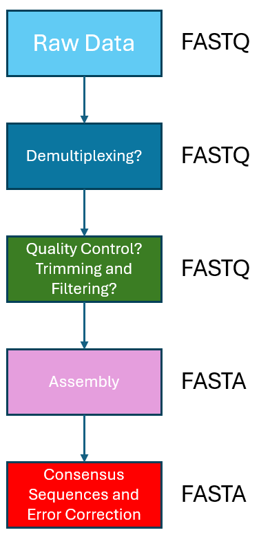

### Exercise 2

As we come to the end of today's workshop, we will end it off by doing a "fun exercise" which will also serve as a summary and recap of the contents taught in the previous chapters today. :)

In the imaginary scenario of this exercise, we came across/were given a bacteria strain that performs exceptionally well for our intended application. However, we are unable to identify what strain of bacteria this is, and what are the specific genes and mutations present in this bacteria that enables it to perform the way it does. While we can do 16S rDNA and 18S rDNA sequencing to obtain the taxonomic classification of the cell, it still doesn't give us the information we need to know about its genotype.

To solve our imaginary problem, we lysed the wild-type cell and obtained the genomic DNA of the cell using a genomic DNA purification kit. We then sheared the genomic DNA into linear fragments through mechanical means, and prepared the DNA for sequencing using a ligation sequencing kit. The prepared library was then loaded into a Flongle R10 flow cell, sequenced and basecalled through the MinKNOW app with Super-High Accurary settings, and filtered for a minimum Qscore of 10. The raw basecalled sequencing files can be found in `~/ngs_workshop/assembly/fastq_pass`. The workflow for a general genome assembly/DNA sequence assembly is depicted in the image below.

### Step 1. Quality Control

As this DNA library was prepared and sequenced without the use of any barcoding kits/barcodes, we will move on directly to the quality control step of the workflow. We will use [FastQC] to assess the read quality. But before we do that, lets first merge all the individual .fastq files into a single file so as to make our life easier! (there are 200+ files because by default, MinKNOW saves the basecalled output into a new FastQ file every ~10 minutes).

~~~
# Lets first make sure we are in the right directory
cd ~/ngs_workshop/assembly/fastq_pass

# And then create a new directory to store our merged fastq file, so as to minimise any potential hiccups that might occur when we recursively go through all the fastq files later in this directory
mkdir merged

# We will now merge ALL the raw .fastq files into one .fastq file into the ./merged directory, using "cat" -- short for "concatenate", which is pre-installed in most linux platforms
# We will name the output file "R10_BL21.fastq.gz" (or whatever you want!)
cat *.fastq.gz > ./merged/R10_BL21.fastq.gz

# (Optional) We will now go into the ./merged directory, and unzip the .fastq.gz file
cd merged
gunzip -k *.gz
~~~
{: .bash}

We will now run FastQC on this merged .fastq file! We can either simply enter `fastqc` into the command line and generate the report through the GUI application. Or generate the report through the command line. Here we will show again how to generate the report through the command line. We can use either .fastqc or compressed .fastqc.gz file as input. We have omitted the `-o` parameter choose and decided to simply store the FastQC report in the existing directory. Due to the relatively larger size of this .fastq file compared to the one we used for variant calling, we added a `-t 2` parameter to increase the processing thread count and hence increasing the total memory that can be allocated for processing this larger .fastq file (we can increase the thread count appropriately as needed, but we should take note not to run more threads than our available memory! In particular not more than 6 threads on a 32 bit machine!). 

~~~
fastqc R10_BL21.fastq  -t 2
~~~
{: .bash}

> ## Generate a QC report with PycoQC!
>
> We can also generate a QC report with PycoQC just for fun! 
>
> > ## Solution
> >
> > ~~~
> > # Go to the directory containing the sequencing_summary.txt file
> > cd ~/ngs_workshop/assembly
> > # Generate the PycoQC report
> > pycoQC -f sequencing_summary_ATH727_a2b50ed3_b9fd1fba.txt -o R10_BL21_pycoQC.html
> > ~~~
> > {: .bash}
> >
> {: .solution}
> 
{: .challenge}

lets take a look at the QC reports!

### Step 2. Filtering

Since we can see that the head quality indeed is of lower quality. Lets do some head and tail cropping of the reads, since we are doing long read sequencing here and can afford to! We will crop the head and tail 150bp, which is generally the region historically [reported to be of relatively lower quality]. To do so, we will use the program [nanofilt]. `--headcrop 150 --tailcrop 150` crops the first and last 150bp of each read, `-l 2000` filters out reads shorter than 2000 bp. Lets also try `-q 13` to filter out reads with Qscore below 13. `> R10_BL21_trimmed.fastq` pipes and saves the output into "R10_BL21_trimmed.fastq"; else NanoFilt will spit the output directly onto the command line -- try it for fun!

~~~
NanoFilt R10_BL21.fastq -q 13 -l 2000 --headcrop 150 --tailcrop 150 > R10_BL21_trimmed.fastq
~~~
{: .bash}

Now lets run FastQC again on the trimmed.fastq file. We should now see that the mean of the "Per Base Sequence Quality" is now all in the "green"!

### Step 3. Assembly

(Genome) assembly is the process of putting together your reads, short-reads, long-reads or both, into long contiguous sequences (contigs). Again as with everything else, many programs are available for assembly. EPI2ME's Clone Validation Workflow (for plasmid de novo assembly) uses [flye] by default and offers [canu] as an alternative. Both are very capable assemblers, and canu in particular even does sequence correction, trimming, assembly and cleanup all together! However, canu requires much more computational resources to run, and will likely exceed the time available in this workshop to run. Hence, we will explore flye here instead.

Due to the dependencies required for flye, we will install flye into a new conda environment, as follows:

~~~
# new environment created with name "flye"
conda create --name flye -c conda-forge -c bioconda flye 
~~~
{: .bash}

Thereafter, we can change into the "flye" environment with `conda activate flye`. We can then run flye on the NanoFilt filtered reads!

~~~
# Create a new directory to store the flye-assembled output
mkdir flye_output
flye --nano-hq ./R10_BL21.fastq --genome-size 4.5m --out-dir ./flye_output
~~~
{: .bash}

> Assembler of Choice?
>
> Note that there generally isnt a "best assembler to use"! The choice and performance of assemblers will vary across different circumstances. Factors such as genome size, repetitiveness, GC content and others can all influence the performance of the assemblers! If one is to really do a serious genome assembly for their research/project, they should explore multiple assemblers, compare their results using a metric and decide for themselves which assembler to use! 
>
{: .warning}

### Step 4. Cleanup

[FastQC]: https://www.bioinformatics.babraham.ac.uk/projects/fastqc/
[reported to be of relatively lower quality]: https://journals.plos.org/plosone/article?id=10.1371/journal.pone.0257521
[nanofilt]: https://github.com/wdecoster/nanofilt
[flye]: https://github.com/mikolmogorov/Flye
[canu]: https://github.com/marbl/canu
