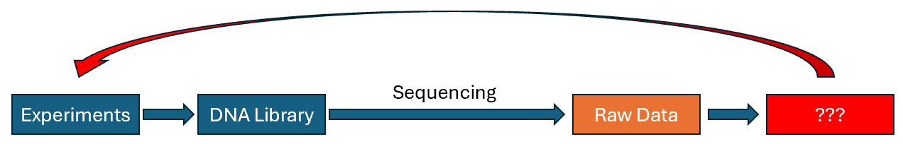

This website is a supplement to a quick crash course for NGS data processing, with a focus on Oxford Nanopore Technologies (ONT). This workshop is designed for POH Lab, and primarily targeted at users with minimal to no experience and background in bioinformatics and NGS data processing. The contents, tools and packages used in this workshop are widely available on the internet, and are curated here with the intention that anyone should be able to run them on any computer, regardless of compute power.

In this workshop, we will briefly go through the setting up of a run on a MINion Sequencing Device with Flongle Adapter, through the MinKNOW UI. We will highlight the main parameters affecting the sequencing run which users will want to take note of to maximise their throughput and data quality. We will briefly demonstrate how the EPI2ME platform provided and maintained by ONT can be used for simple workflows, such as for plasmid De novo assembly, and custom alignment to a known reference seqeunce.

Thereafter, we will go through a (very very) quick and basic crash course on using the Bash Shell, and highlight some simple commands which new users should get to know. This will be followed by a quick segment on how we can visualise data output from EPI2ME earlier, such as through the IGV viewer. And we will end with an introduction to methods for Multiplexing, Quality Checks, Variant Calling workflows, and Genome Assembly workflows through two example excercises. 

It is hoped that through this quick and basic workshop, new users will be able to better understand, analyze and make use of NGS data -- especially from the ONT platform; so as to aid them in their experiments.

<!-- this is an html comment -->

 This is a comment in Liquid 

> ## Prerequisites
>
> This lesson also assumes some familiarity with biological concepts, including the structure of DNA, nucleotide abbreviations.
> While no experience with the bash shell is required, a little prior coding experience is recommended -- for ease of understanding.
>  
>  
> Having a working bash shell along with the packages in "install_script.sh" installed prior to the workshop is recommended to speed things up.
> 
{: .prereq}


